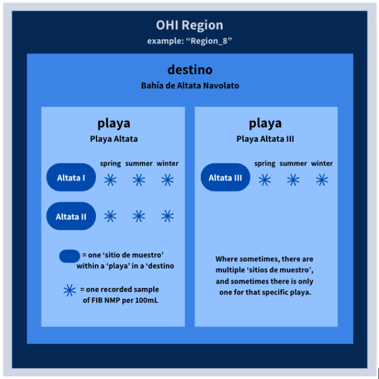

# {width=8% height=8%} Aguas Limpias EWG 3.3 {#ewg33-cw}

<div class="button-container">
  <a href="ewg33_cw.html" class="custom-button">
    <i class="fas fa-globe"></i> in English
  </a>
</div>

::: {.callout-important}
## Vista previa: Aguas Limpias (CW)

Planeamos revisar nuestras estimaciones actuales de las puntuaciones de CW en la reunión del Grupo de Trabajo de Expertos 3.3. Este documento tiene como propósito darles un panorama del modelo de la meta, el razonamiento detrás de la metodología de cada componente y una vista previa de los resultados antes de que nos reunamos. Si tienen inquietudes metodológicas menores, por favor señálenlas y tráiganlas a la reunión. Si tienen inquietudes metodológicas mayores, por favor compártanlas conmigo de antemano (mi correo es [smanos@nceas.ucsb.edu](mailto:smanos@nceas.ucsb.edu)). Si no pueden asistir a la reunión pero les gustaría discutir, con gusto me reúno 1:1 antes o después. Tengan presente que este documento es solo para uso interno y con fines informativos. No debe interpretarse como la última palabra ni como de calidad de revisión por pares. ¡Gracias por su continuo involucramiento con este trabajo! Esperamos discutir estas puntuaciones con ustedes el 10 de septiembre.
:::

::: {.callout-tip collapse="true"}
# <i class="fa-regular fa-star"></i> Acerca de la meta CW

La meta de Aguas Limpias (CW) mide el grado en que las aguas locales están libres de contaminación por fuentes antropogénicas. Las personas valoran las aguas marinas libres de contaminación y residuos por razones estéticas y de salud. La contaminación de las aguas proviene de diversas fuentes, como derrames de petróleo, químicos, carga de nutrientes (eutrofización), patógenos de enfermedades (p. ej., coliformes fecales, virus y parásitos provenientes de descargas de aguas residuales) y basura flotante. Las personas son sensibles a estos contaminantes, especialmente en áreas a las que acceden para recreación, y otorgan un alto "valor de existencia" al simple hecho de saber que existen aguas limpias. Incluimos cuatro componentes de contaminación en nuestra meta de Aguas Limpias: patógenos, químicos, eutrofización (nutrientes) y residuos marinos. El estatus de estos componentes es típicamente la inversa de su intensidad: una alta contaminación produce una puntuación de estatus baja, y la meta obtiene las puntuaciones más altas cuando la contaminación está cerca de cero. El cálculo de las puntuaciones de CW incluye estos componentes:

1. Patógenos (PAT)
2. Químicos (CHM)
   - Plaguicidas (PEST)
   - Productos farmacéuticos (PHRM)
   - Sitios de residuos peligrosos (HAZW)
   - Sitios de puntos de descarga de aguas residuales sin tratamiento (WWPS)
   - Estimación de hidrocarburos de embarcaciones (VESS)
   - Microplásticos (MCRO): explorados, pero no puntuados debido a limitaciones de datos
3. Eutrofización (EUT)
4. Residuos marinos (MAR)
   - Riesgo de artes de pesca fantasma (RIGG): usado para el estatus de MAR
   - Basura / residuos (TRAS): explorado, pero no puntuado debido a limitaciones de datos

Una puntuación de 100 significa que la región está en el "estado ideal" para ese indicador.

**DEFINICIÓN CENTRAL**

- **Enfoque:** Qué tan libres están las aguas costeras de la contaminación causada por las personas que afecta la salud, la recreación, los alimentos del mar y la condición ecológica, en relación con el estado ideal de contaminación cero.
- **No se trata de:** Las cantidades físicas exactas de contaminantes dentro de las aguas costeras locales del Golfo o que entran a ellas. La puntuación representa el riesgo relativo con base en la efectividad del manejo, ya que solo tuvimos acceso a monitoreo *in situ* consistente para el subcomponente de Patógenos.
- **Énfasis:** Identificar los tipos de contaminación que impactan tanto a las comunidades ecológicas como a las humanas a lo largo de la costa del Golfo.

## Modelo de la meta

A nivel de la meta, combinamos los cuatro componentes con un promedio aritmético simple: CW = promedio(Patógenos, Químicos, Eutrofización, Residuos marinos)

$$\text{CW}_{r,t} = \frac{PAT_{r,t} + CHM_{r,t} + EUT_{r,t} + MAR_{r,t}}{4}$$

Para cada región OHI del Golfo de California, $r$, y año, $t$. Sí consideramos una media geométrica, que es como se combinan los componentes de Aguas Limpias dentro del marco de OHI Global. Sin embargo, decidimos que no tendría sentido en este caso porque la media geométrica debería usarse principalmente cuando una puntuación muy baja en un componente afectaría negativamente a la región de tal manera que las puntuaciones de los demás componentes resultarían irrelevantes. Para que este enfoque tenga sentido, una puntuación de subcomponente de 0 debe indicar un nivel de contaminación con implicaciones biológicas dramáticas en la región. Sin embargo, con base en los puntos de referencia que usamos para la mayoría de los componentes, un estatus actual de cero no indica que "nada podría vivir allí" o que sea absolutamente imposible nadar, sino más bien que, en comparación con otras regiones y años, esa región tuvo aguas iguales a las más contaminadas para ese tipo de contaminante observadas en el Golfo. Eso significa que, aunque la contaminación no sea tan grave como la del lugar más contaminado del mundo, es la peor de la región. Por ejemplo, descubrimos que usar la media geométrica haría que la costa de Sinaloa tuviera una puntuación de Aguas Limpias de cero en 2017 porque la presión de Residuos marinos que mide el riesgo de artes de pesca fantasma estaba en su máximo. No pensamos que esta puntuación representara con precisión la calidad del agua de la región, dadas las consecuencias biológicas de este componente así como las puntuaciones de los demás componentes. Esto confirmó aún más nuestra decisión de ponderar por igual los 4 componentes de contaminación que medimos.

| Componente | Qué mide |
| --- | --- |
| Patógenos | Niveles de *Enterococcus* en playas monitoreadas (Playas Limpias) |
| Químicos | Promedio de plaguicidas, productos farmacéuticos, sitios de residuos peligrosos, descargas de aguas residuales sin tratamiento y riesgo de hidrocarburos de embarcaciones. En el futuro, también incluirá microplásticos. |
| Eutrofización | Exceso de nitrógeno que llega a la costa proveniente de aguas residuales, agricultura, ganadería y acuacultura de camarón |
| Residuos marinos | Riesgo de artes de pesca abandonadas ("artes fantasma"). La basura / residuos de gran tamaño se exploró, pero aún no se puntuó. |

Las puntuaciones se calculan para cada una de las nueve regiones OHI del Golfo de California. Una puntuación de 100 representa el estado ideal de aguas limpias.
:::

```{r, echo=FALSE, warning=FALSE, message=FALSE}
library(tidyverse)
library(plotly)
library(here)

rgn_labels <- c(
  "Region_1" = "Alto Golfo occidental",
  "Region_2" = "Islas del Medio (oeste)",
  "Region_3" = "Golfo central occidental",
  "Region_4" = "Golfo sur occidental",
  "Region_5" = "Alto Golfo oriental",
  "Region_6" = "Islas del Medio (este)",
  "Region_7" = "Costa sur de Sonora",
  "Region_8" = "Costa de Sinaloa",
  "Region_9" = "Entrada del Golfo"
)

rgn_colors <- c(
  "Region_1" = "#C03729",
  "Region_2" = "#E68C7C",
  "Region_3" = "#FC8F24",
  "Region_4" = "#dcaa38",
  "Region_5" = "#cbd2a0",
  "Region_6" = "#98a25a",
  "Region_7" = "#747428",
  "Region_8" = "#627391",
  "Region_9" = "#8d61a9"
)

region_levels <- paste0("Region_", 1:9)
rgn_label_colors <- setNames(unname(rgn_colors[region_levels]), unname(rgn_labels[region_levels]))

add_rgn_labels <- function(df) {
  df %>%
    mutate(
      rgn_id = factor(as.character(rgn_id), levels = region_levels),
      rgn_label = factor(
        rgn_labels[as.character(rgn_id)],
        levels = unname(rgn_labels[region_levels])
      )
    )
}

cw_plotly_lines <- function(df, y_var, title, y_range = c(0, 105),
                            connect_gaps = TRUE) {
  df <- df %>%
    mutate(year = as.numeric(year)) %>%
    arrange(rgn_label, year)

  year_breaks <- sort(unique(df$year[!is.na(df$year)]))
  df_drawn <- if (isTRUE(connect_gaps)) {
    df %>% dplyr::filter(!is.na(.data[[y_var]]))
  } else {
    df
  }

  plot_ly(
    df_drawn,
    x = ~year,
    y = as.formula(paste0("~", y_var)),
    color = ~rgn_label,
    colors = rgn_label_colors,
    type = "scatter",
    mode = "lines+markers",
    connectgaps = isTRUE(connect_gaps)
  ) %>%
    layout(
      title = title,
      xaxis = list(
        title = "Año // Year",
        tickmode = "array",
        tickvals = year_breaks,
        ticktext = as.character(as.integer(year_breaks)),
        range = range(year_breaks)
      ),
      yaxis = list(title = "Puntaje // Percent (out of 100)", range = y_range),
      legend = list(title = list(text = "Región"))
    ) %>%
    add_lines(
      x = range(year_breaks),
      y = c(100, 100),
      line = list(color = "black", width = 2, dash = "dash"),
      name = "Meta // Goal (100/100)",
      inherit = FALSE
    )
}

cw_plotly_goc <- function(df, y_var, title, y_range = c(0, 105),
                          connect_gaps = TRUE) {
  df <- df %>%
    mutate(year = as.numeric(year)) %>%
    arrange(year)

  year_breaks <- sort(unique(df$year[!is.na(df$year)]))
  df_drawn <- if (isTRUE(connect_gaps)) {
    df %>% dplyr::filter(!is.na(.data[[y_var]]))
  } else {
    df
  }

  plot_ly(
    df_drawn,
    x = ~year,
    y = as.formula(paste0("~", y_var)),
    type = "scatter",
    mode = "lines+markers",
    name = "Promedio GoC",
    connectgaps = isTRUE(connect_gaps)
  ) %>%
    layout(
      title = title,
      xaxis = list(
        title = "Año // Year",
        tickmode = "array",
        tickvals = year_breaks,
        ticktext = as.character(as.integer(year_breaks)),
        range = range(year_breaks)
      ),
      yaxis = list(title = "Puntaje // Percent (out of 100)", range = y_range)
    ) %>%
    add_lines(
      x = range(year_breaks),
      y = c(100, 100),
      line = list(color = "black", width = 2, dash = "dash"),
      name = "Meta // Goal (100/100)",
      inherit = FALSE
    )
}
```

```{r, echo=FALSE, warning=FALSE, message=FALSE}
# Status tables live on Mazu under goal_prep/cw
cw_root <- "/home/shares/ohi/OHI_GOC/goal_prep/cw/v2025"

eutro_cs <- read_csv(
  file.path(cw_root, "eutrophication/output/eutrophication_cs.csv"),
  show_col_types = FALSE
) %>%
  dplyr::select(rgn_id, final_score = current_status) %>%
  group_by(rgn_id) %>%
  mutate(year = 2017) %>%
  complete(year = 2017:2025) %>%
  fill(final_score, .direction = "down") %>%
  ungroup()

# Updated pathogens series (2018-2025; 2020 left missing for the COVID pause)
path_cs <- read_csv(
  file.path(cw_root, "pathogens/output/pathogen_cs_2018_2025.csv"),
  show_col_types = FALSE
) %>%
  dplyr::select(rgn_id, year, final_score = current_status) %>%
  mutate(
    year = as.numeric(year),
    final_score = suppressWarnings(as.numeric(final_score))
  ) %>%
  group_by(rgn_id) %>%
  tidyr::complete(year = 2018:2025) %>%
  # Explicit COVID pause: keep the year on the axis, but no score / no point
  mutate(final_score = ifelse(year == 2020, NA_real_, final_score)) %>%
  ungroup()

chem_cs <- read_csv(
  file.path(cw_root, "chemicals/chemical_cs.csv"),
  show_col_types = FALSE
) %>%
  dplyr::select(rgn_id, year, final_score = chemical_cs,
                PEST, PHRM, WWPS, HAZW, VESS) %>%
  group_by(rgn_id) %>%
  complete(year = 2017:2025) %>%
  fill(final_score, PEST, PHRM, WWPS, HAZW, VESS, .direction = "down") %>%
  ungroup()

pest_cs <- read_csv(
  file.path(cw_root, "chemicals/pesticides/output/cw_chemical_pesticide_current_status.csv"),
  show_col_types = FALSE
) %>%
  dplyr::select(rgn_id, year, final_score = current_status_final)

phrm_cs <- read_csv(
  file.path(cw_root, "chemicals/pharmaceuticals/current_status_pharmaceuticals.csv"),
  show_col_types = FALSE
) %>%
  dplyr::select(rgn_id, year, final_score = current_status_final)

hazw_cs <- read_csv(
  file.path(cw_root, "chemicals/hazardous_waste/output/current_status_hazardous_waste.csv"),
  show_col_types = FALSE
) %>%
  dplyr::select(rgn_id, year = anio, final_score)

wwps_cs <- read_csv(
  file.path(cw_root, "chemicals/agua_sin_tratamiento/output/untreated_ww_current_status.csv"),
  show_col_types = FALSE
) %>%
  dplyr::select(rgn_id, year = census_year, final_score = current_status_final)

vess_cs <- chem_cs %>%
  dplyr::select(rgn_id, year, final_score = VESS) %>%
  filter(!is.na(final_score))

pla_cs <- read_csv(
  file.path(cw_root, "marine_debris/ghost_gear_risk.csv"),
  show_col_types = FALSE
) %>%
  mutate(final_score = (1 - pressure) * 100) %>%
  dplyr::select(rgn_id, year, final_score)

# Precomputed overall CW (arithmetic mean of PAT, CHM, EUT, MAR)
cw_status_raw <- read_csv(
  file.path(cw_root, "cw_current_status_arithmetic.csv"),
  show_col_types = FALSE
)

cw_score_col <- intersect(c("CW", "final_score", "current_status", "cw"), names(cw_status_raw))[1]
if (is.na(cw_score_col)) {
  stop(
    "cw_current_status_arithmetic.csv needs a score column named CW, final_score, or current_status. ",
    "Found: ", paste(names(cw_status_raw), collapse = ", ")
  )
}

cw_status <- cw_status_raw %>%
  mutate(final_score = .data[[cw_score_col]]) %>%
  dplyr::select(rgn_id, year, final_score)

cw_goc <- cw_status %>%
  group_by(year) %>%
  summarize(final_score = mean(final_score, na.rm = TRUE), .groups = "drop")

chem_goc <- chem_cs %>%
  group_by(year) %>%
  summarize(final_score = mean(final_score, na.rm = TRUE), .groups = "drop")

path_goc <- path_cs %>%
  group_by(year) %>%
  summarize(
    final_score = if (all(is.na(final_score))) {
      NA_real_
    } else {
      mean(final_score, na.rm = TRUE)
    },
    .groups = "drop"
  )

pla_goc <- pla_cs %>%
  group_by(year) %>%
  summarize(final_score = mean(final_score, na.rm = TRUE), .groups = "drop")

cw_score_plotly <- cw_plotly_lines(
  add_rgn_labels(cw_status),
  y_var = "final_score",
  title = "Aguas Limpias general (promedio aritmético de PAT, CHM, EUT, MAR)"
)

cw_overall_goc_plotly <- cw_plotly_goc(
  cw_goc,
  y_var = "final_score",
  title = "Estatus actual promedio de Aguas Limpias en todo el Golfo"
)

eut_plotly <- cw_plotly_lines(
  add_rgn_labels(eutro_cs),
  y_var = "final_score",
  title = "CW Eutrofización"
)

pat_plotly <- cw_plotly_lines(
  add_rgn_labels(path_cs),
  y_var = "final_score",
  title = "CW Patógenos (2018-2025)"
)

pat_goc_plotly <- cw_plotly_goc(
  path_goc,
  y_var = "final_score",
  title = "Estatus actual promedio de Patógenos en todo el Golfo"
)

chem_plotly <- cw_plotly_lines(
  add_rgn_labels(chem_cs),
  y_var = "final_score",
  title = "CW Químicos"
)

chem_goc_plotly <- cw_plotly_goc(
  chem_goc,
  y_var = "final_score",
  title = "Estatus actual promedio de Químicos en todo el Golfo"
)

pest_plotly <- cw_plotly_lines(
  add_rgn_labels(pest_cs),
  y_var = "final_score",
  title = "CW Químicos: Plaguicidas"
)

phrm_plotly <- cw_plotly_lines(
  add_rgn_labels(phrm_cs),
  y_var = "final_score",
  title = "CW Químicos: Productos farmacéuticos"
)

hazw_plotly <- cw_plotly_lines(
  add_rgn_labels(hazw_cs),
  y_var = "final_score",
  title = "CW Químicos: Sitios de residuos peligrosos"
)

wwps_plotly <- cw_plotly_lines(
  add_rgn_labels(wwps_cs),
  y_var = "final_score",
  title = "CW Químicos: Puntos de aguas residuales sin tratamiento"
)

vess_plotly <- cw_plotly_lines(
  add_rgn_labels(vess_cs),
  y_var = "final_score",
  title = "CW Químicos: Hidrocarburos de embarcaciones"
)

pla_plotly <- cw_plotly_lines(
  add_rgn_labels(pla_cs),
  y_var = "final_score",
  title = "CW Residuos marinos: Riesgo de artes fantasma"
)

pla_goc_plotly <- cw_plotly_goc(
  pla_goc,
  y_var = "final_score",
  title = "Estatus actual promedio de Residuos marinos (artes fantasma) en todo el Golfo"
)
```

## Estado general de Aguas Limpias

Para muchas presiones que inician en tierra, el método es similar: la actividad ocurre tierra adentro, estimamos cuánta presión puede moverse hacia el mar, asignamos esa intensidad a la región OHI donde es más probable que afecte la costa del Golfo, y luego convertimos una mayor intensidad en una puntuación de estatus más baja.

El ideal suele ser una presión de contaminación cero. Para varios indicadores químicos, el extremo bajo de la escala se basa en las presiones más altas que observamos a lo largo de las regiones y años del Golfo (a menudo usando la media de las cinco observaciones más altas, de modo que un valor atípico extremo no fije toda la escala por sí solo). Esas puntuaciones son rankings relativos dentro de esta evaluación. El único componente en el que eso no es el caso es Patógenos, ya que México ya tiene un umbral claro de aptitud de playas que podemos usar como punto de referencia, y todos los datos se miden *in situ*.

El mapa siguiente muestra las regiones OHI del Golfo de California junto con los límites de cuencas y los puntos de descarga costeros. Esta es la estructura espacial usada para varias presiones de Aguas Limpias que inician en tierra (especialmente químicos).

```{r, echo=FALSE, warning=FALSE, message=FALSE, fig.width=7.2, fig.height=8.2}
# Watershed + pour point overview map (same spatial scaffolding as the docx draft)
library(sf)
library(scales)
library(grid)

pick_existing <- function(...) {
  paths <- unlist(list(...), use.names = FALSE)
  hit <- paths[file.exists(paths)]
  if (length(hit) == 0) NA_character_ else hit[[1]]
}

normalize_rgn_id <- function(x) {
  x %>%
    as.character() %>%
    stringr::str_squish() %>%
    stringr::str_replace_all(" ", "_")
}

gg_theme_map <- function() {
  theme_void(base_size = 11) +
    theme(
      panel.background = element_rect(fill = "white", color = NA),
      plot.background = element_rect(fill = "white", color = NA),
      plot.title = element_text(face = "bold", size = 11, hjust = 0.5),
      plot.subtitle = element_text(size = 8, hjust = 0.5),
      legend.position = "bottom",
      legend.direction = "horizontal",
      legend.justification = "center",
      legend.box = "vertical",
      legend.title = element_text(size = 9),
      legend.text = element_text(size = 7.5),
      legend.key.height = unit(0.3, "cm"),
      legend.key.width = unit(0.7, "cm"),
      legend.margin = margin(4, 10, 4, 10),
      legend.box.margin = margin(6, 10, 8, 10),
      plot.margin = margin(10, 18, 18, 18)
    )
}

inland_buffer_ring <- function(buffer_sf, marine_sf) {
  if (is.null(buffer_sf) || is.null(marine_sf)) return(NULL)
  tryCatch({
    buf <- sf::st_make_valid(sf::st_union(sf::st_geometry(buffer_sf)))
    mar <- sf::st_make_valid(sf::st_union(sf::st_geometry(marine_sf)))
    inland <- sf::st_make_valid(sf::st_difference(buf, mar))
    if (length(inland) == 0 || all(sf::st_is_empty(inland))) return(NULL)
    sf::st_as_sf(data.frame(id = 1L), geometry = inland)
  }, error = function(e) NULL)
}

safe_read_sf <- function(path) {
  if (is.na(path) || !file.exists(path)) return(NULL)
  tryCatch(sf::st_read(path, quiet = TRUE), error = function(e) NULL)
}

prep_rgn_polygons <- function(x, marine_only = FALSE) {
  if (is.null(x)) return(NULL)
  if (!"rgn_id" %in% names(x)) {
    id_alt <- intersect(c("rgn", "region_id", "REGION_ID", "id"), names(x))
    if (length(id_alt) > 0) {
      names(x)[names(x) == id_alt[[1]]] <- "rgn_id"
    }
  }
  if (!"rgn_id" %in% names(x)) return(NULL)
  if (isTRUE(marine_only) && "location" %in% names(x)) {
    x <- x %>% dplyr::filter(tolower(as.character(location)) == "marine")
  }
  x %>%
    mutate(rgn_id = normalize_rgn_id(rgn_id)) %>%
    group_by(rgn_id) %>%
    summarise(.groups = "drop")
}

assign_points_to_regions <- function(pts, poly_sf, label = "points") {
  if (is.null(pts) || nrow(pts) == 0) return(pts)
  n0 <- nrow(pts)
  if (is.null(poly_sf) || nrow(poly_sf) == 0) return(pts)
  pts <- tryCatch(sf::st_make_valid(pts), error = function(e) pts)
  poly <- poly_sf %>%
    mutate(rgn_id = normalize_rgn_id(rgn_id)) %>%
    dplyr::select(rgn_id)
  hits <- tryCatch(sf::st_intersects(pts, poly), error = function(e) vector("list", n0))
  rgn_vec <- vapply(seq_len(n0), function(i) {
    ix <- hits[[i]]
    if (is.null(ix) || length(ix) == 0) NA_character_ else as.character(poly$rgn_id[[ix[[1]]]])
  }, character(1))
  miss <- which(is.na(rgn_vec) | rgn_vec == "")
  if (length(miss) > 0) {
    near_ix <- tryCatch(sf::st_nearest_feature(pts[miss, ], poly), error = function(e) integer(0))
    if (length(near_ix) == length(miss)) {
      rgn_vec[miss] <- as.character(poly$rgn_id[near_ix])
    }
  }
  pts$rgn_id <- normalize_rgn_id(rgn_vec)
  pts
}

filter_pourpoints_goc_side <- function(
    pts,
    buffer50,
    buffer10,
    tight_10km_regions = c("Region_1", "Region_2", "Region_3", "Region_4")
) {
  if (is.null(pts) || nrow(pts) == 0) return(pts)
  if (is.null(buffer50) || nrow(buffer50) == 0) return(pts)
  pts <- tryCatch(sf::st_make_valid(pts), error = function(e) pts)
  buf50 <- tryCatch(sf::st_make_valid(buffer50), error = function(e) buffer50)
  pts50 <- tryCatch(
    sf::st_filter(pts, buf50),
    error = function(e) {
      tryCatch(
        suppressWarnings(sf::st_intersection(pts, sf::st_union(sf::st_geometry(buf50)))),
        error = function(e2) pts
      )
    }
  )
  if (is.null(pts50) || nrow(pts50) == 0) return(pts50)
  pts50 <- assign_points_to_regions(pts50, buf50, label = "GoC 50 km pour points")
  if (!is.null(buffer10) && nrow(buffer10) > 0) {
    buf10 <- tryCatch(sf::st_make_valid(buffer10), error = function(e) buffer10)
    in10 <- tryCatch(
      lengths(sf::st_intersects(pts50, sf::st_union(sf::st_geometry(buf10)))) > 0,
      error = function(e) rep(TRUE, nrow(pts50))
    )
    rgn_chr <- normalize_rgn_id(pts50$rgn_id)
    drop_pacific <- rgn_chr %in% tight_10km_regions & !in10
    pts50 <- pts50[!drop_pacific, ]
  }
  pts50
}

local_cw <- here::here("cw_mazu/v2025")
if (!dir.exists(local_cw)) local_cw <- here::here("../cw_mazu/v2025")
if (!dir.exists(local_cw)) local_cw <- "/Users/manos/Documents/Cursor/CW_pesticides/cw_mazu/v2025"

spatial_dir <- "/home/shares/ohi/OHI_GOC/spatial/OHI_regions"
rgn_path <- pick_existing(
  file.path(spatial_dir, "goc_ohi_rgns.shp"),
  file.path(spatial_dir, "marine_and_inland10.gpkg")
)
buffer_path <- pick_existing(file.path(spatial_dir, "marine_and_inland10.gpkg"))
buffer50_path <- pick_existing(file.path(spatial_dir, "marine_and_inland50.gpkg"))
ws_path <- pick_existing(
  file.path(spatial_dir, "watersheds_goc.gpkg"),
  "/home/shares/ohi/stressors_2021/_dataprep/nutrients/watersheds_pourpoints/watersheds_all_4326.shp"
)
pp_path <- pick_existing(
  file.path(spatial_dir, "pourpoints_goc.gpkg"),
  "/home/shares/ohi/stressors_2021/_dataprep/nutrients/watersheds_pourpoints/pourpoints_mol.shp",
  file.path(cw_root, "chemicals/pesticides/int/total_agriculture_pesticides_kg_pourpoints_rgnid_allyears.gpkg"),
  file.path(local_cw, "chemicals/pesticides/int/total_agriculture_pesticides_kg_pourpoints_rgnid_allyears.gpkg")
)
pp_full_path <- pick_existing(
  "/home/shares/ohi/stressors_2021/_dataprep/nutrients/watersheds_pourpoints/pourpoints_mol.shp"
)
states_path <- pick_existing(
  file.path(spatial_dir, "states.shp"),
  file.path(spatial_dir, "goc_states.shp"),
  "/home/shares/ohi/OHI_GOC/spatial/ohi_regions/states.shp"
)
pest_pp_path <- pick_existing(
  file.path(cw_root, "chemicals/pesticides/int/total_agriculture_pesticides_kg_pourpoints_rgnid_allyears.gpkg"),
  file.path(local_cw, "chemicals/pesticides/int/total_agriculture_pesticides_kg_pourpoints_rgnid_allyears.gpkg")
)

regions_sf <- prep_rgn_polygons(safe_read_sf(rgn_path), marine_only = TRUE)
if (is.null(regions_sf) || nrow(regions_sf) == 0) {
  regions_sf <- prep_rgn_polygons(safe_read_sf(rgn_path), marine_only = FALSE)
}
rgn_buffer_sf <- prep_rgn_polygons(safe_read_sf(buffer_path), marine_only = FALSE)
if (is.null(rgn_buffer_sf)) rgn_buffer_sf <- regions_sf
rgn_buffer50_sf <- prep_rgn_polygons(safe_read_sf(buffer50_path), marine_only = FALSE)
states_sf <- safe_read_sf(states_path)
watersheds_sf <- safe_read_sf(ws_path)
pourpoints_base_sf <- safe_read_sf(pp_path)
pourpoints_full_sf <- safe_read_sf(pp_full_path)
if (!is.null(pourpoints_full_sf)) {
  if (is.null(pourpoints_base_sf) || nrow(pourpoints_full_sf) >= nrow(pourpoints_base_sf)) {
    pourpoints_base_sf <- pourpoints_full_sf
  }
}
pest_pp_sf <- safe_read_sf(pest_pp_path)

align_to_regions <- function(x) {
  if (is.null(x) || is.null(regions_sf)) return(x)
  tryCatch(st_transform(x, st_crs(regions_sf)), error = function(e) x)
}
states_sf <- align_to_regions(states_sf)
rgn_buffer_sf <- align_to_regions(rgn_buffer_sf)
rgn_buffer50_sf <- align_to_regions(rgn_buffer50_sf)
watersheds_sf <- align_to_regions(watersheds_sf)
pourpoints_base_sf <- align_to_regions(pourpoints_base_sf)
pest_pp_sf <- align_to_regions(pest_pp_sf)

pourpoints_base_sf <- filter_pourpoints_goc_side(
  pourpoints_base_sf,
  buffer50 = rgn_buffer50_sf,
  buffer10 = rgn_buffer_sf
)

inland10_sf <- inland_buffer_ring(rgn_buffer_sf, regions_sf)

playas_path <- pick_existing(
  file.path(cw_root, "pathogens/int/playas_limpias_rgnid_2018_2025.gpkg"),
  file.path(cw_root, "pathogens/int/playas_limpias_rgnid.gpkg"),
  file.path(local_cw, "pathogens/int/playas_limpias_rgnid.gpkg")
)
hazw_path <- pick_existing(
  file.path(cw_root, "chemicals/hazardous_waste/int/all_hazardous_sites_50km.gpkg"),
  file.path(local_cw, "chemicals/hazardous_waste/int/all_hazardous_sites_50km.gpkg")
)
wwtp_pp_path <- pick_existing(
  file.path(cw_root, "chemicals/pharmaceuticals/humans_int/pourpoints_effluent_wwtp_liters_final.gpkg"),
  file.path(local_cw, "chemicals/pharmaceuticals/humans_int/pourpoints_effluent_wwtp_liters_final.gpkg")
)

playas_sf <- align_to_regions(safe_read_sf(playas_path))
hazw_sf <- align_to_regions(safe_read_sf(hazw_path))
wwtp_pp_sf <- align_to_regions(safe_read_sf(wwtp_pp_path))
inland50_sf <- inland_buffer_ring(rgn_buffer50_sf, regions_sf)
if (is.null(inland50_sf)) inland50_sf <- inland10_sf

# TR / Access / LSP-style ramp: 0 = dark red, 100 = blue
cw_score_palette <- c(
  "#8a0032", "#A50026", "#A50026", "#D73027", "#F46D43",
  "#FDAE61", "#FEE090", "#FEE090", "#ABD9E9", "#4575B4", "#313695"
)
cw_na_fill <- "white"

cw_map_choropleth <- function(regions_sf, scores_df, title, subtitle = NULL,
                              states_sf = NULL, label_scores = FALSE) {
  if (is.null(regions_sf) || is.null(scores_df) || nrow(scores_df) == 0) {
    return(ggplot() + theme_void() + labs(title = paste(title, "(mapa no disponible)")))
  }

  latest <- scores_df %>%
    filter(!is.na(final_score)) %>%
    mutate(rgn_id = normalize_rgn_id(rgn_id)) %>%
    group_by(rgn_id) %>%
    filter(year == max(year, na.rm = TRUE)) %>%
    ungroup() %>%
    dplyr::select(rgn_id, year, score = final_score) %>%
    mutate(score = ifelse(is.nan(score), NA_real_, score))

  yr <- unique(latest$year)
  if (is.null(subtitle) && length(yr) > 0) {
    subtitle <- paste0("Año de la captura: ", paste(yr, collapse = ", "))
  }

  dat <- regions_sf %>%
    mutate(rgn_id = normalize_rgn_id(rgn_id)) %>%
    left_join(latest, by = "rgn_id") %>%
    mutate(rgn_label = unname(rgn_labels[rgn_id]))

  p <- ggplot()
  if (!is.null(states_sf)) {
    p <- p +
      geom_sf(data = states_sf, fill = "#d6cac0", color = "grey10", linewidth = 0.1)
  }
  p <- p +
    geom_sf(data = dat, aes(fill = score), color = "black", linewidth = 0.2) +
    scale_fill_gradientn(
      colours = cw_score_palette,
      limits = c(0, 100),
      na.value = cw_na_fill,
      name = "Puntaje",
      breaks = seq(0, 100, by = 25)
    ) +
    labs(title = title, subtitle = subtitle) +
    coord_sf(expand = FALSE) +
    gg_theme_map()

  if (isTRUE(label_scores)) {
    p <- p +
      geom_sf_text(
        data = dat %>%
          mutate(label = ifelse(is.na(score), "NA", as.character(round(score)))),
        aes(label = label),
        size = 2.8,
        color = "grey10",
        fun.geometry = function(g) sf::st_point_on_surface(sf::st_make_valid(g))
      )
  }
  p
}

cw_map_points_on_regions <- function(regions_sf, points_sf, title, subtitle = NULL,
                                     size = 2.1, states_sf = NULL,
                                     buffer_sf = NULL, inland_sf = NULL) {
  if (is.null(regions_sf) || is.null(points_sf)) {
    return(ggplot() + theme_void() + labs(title = paste(title, "(mapa no disponible)")))
  }
  regs <- regions_sf %>%
    mutate(rgn_id = normalize_rgn_id(rgn_id)) %>%
    add_rgn_labels()
  if (is.null(inland_sf) && !is.null(buffer_sf)) {
    inland_sf <- inland_buffer_ring(buffer_sf, regions_sf)
  }
  pts <- points_sf %>%
    mutate(rgn_id = normalize_rgn_id(rgn_id)) %>%
    mutate(
      rgn_label = factor(
        rgn_labels[as.character(rgn_id)],
        levels = unname(rgn_labels[region_levels])
      )
    )
  p <- ggplot()
  if (!is.null(states_sf)) {
    p <- p +
      geom_sf(data = states_sf, fill = "#d6cac0", color = "grey40", linewidth = 0.12)
  }
  if (!is.null(inland_sf) && nrow(inland_sf) > 0) {
    p <- p +
      geom_sf(data = inland_sf, fill = "grey65", alpha = 0.22, color = NA, linewidth = 0)
  }
  p <- p +
    geom_sf(
      data = regs,
      aes(fill = rgn_label),
      alpha = 0.4,
      color = "grey55",
      linewidth = 0.25,
      show.legend = FALSE
    )
  p +
    geom_sf(
      data = pts,
      aes(fill = rgn_label),
      shape = 21,
      color = "black",
      stroke = 0.6,
      size = size,
      alpha = 0.95
    ) +
    scale_fill_manual(values = rgn_label_colors, name = "Región") +
    labs(title = title, subtitle = subtitle) +
    coord_sf(expand = FALSE, clip = "off") +
    gg_theme_map() +
    guides(
      fill = guide_legend(ncol = 2, byrow = TRUE, title.position = "top")
    )
}

cw_map <- cw_map_choropleth(
  regions_sf, cw_status, "Estatus general de Aguas Limpias por región",
  states_sf = states_sf
)
eut_map <- cw_map_choropleth(
  regions_sf, eutro_cs, "Estatus actual de eutrofización (EUT)",
  subtitle = "Instantánea única de nitrógeno (Romero-Gil et al.); rojo = 0, azul = 100",
  states_sf = states_sf,
  label_scores = TRUE
)
pat_map <- cw_map_choropleth(
  regions_sf, path_cs, "Estatus de patógenos por región",
  states_sf = states_sf
)
chem_map <- cw_map_choropleth(
  regions_sf, chem_cs, "Estatus de químicos por región",
  states_sf = states_sf
)
pest_map <- cw_map_choropleth(
  regions_sf, pest_cs, "Estatus de plaguicidas por región",
  states_sf = states_sf
)
phrm_map <- cw_map_choropleth(
  regions_sf, phrm_cs, "Estatus de productos farmacéuticos por región",
  states_sf = states_sf
)
hazw_map <- cw_map_choropleth(
  regions_sf, hazw_cs, "Estatus de residuos peligrosos por región",
  states_sf = states_sf
)
wwps_map <- cw_map_choropleth(
  regions_sf, wwps_cs, "Estatus de aguas residuales sin tratamiento por región",
  states_sf = states_sf
)
vess_map <- cw_map_choropleth(
  regions_sf, vess_cs, "Estatus de hidrocarburos de embarcaciones por región",
  states_sf = states_sf
)
mar_map <- cw_map_choropleth(
  regions_sf, pla_cs, "Estatus de residuos marinos por región (artes fantasma)",
  states_sf = states_sf
)

ohi_regions_ref_map <- {
  if (is.null(regions_sf) || nrow(regions_sf) == 0) {
    ggplot() + theme_void() + labs(title = "Regiones OHI (mapa no disponible)")
  } else {
    regs <- regions_sf %>%
      mutate(rgn_id = normalize_rgn_id(rgn_id)) %>%
      mutate(
        Region = factor(
          unname(rgn_labels[as.character(rgn_id)]),
          levels = unname(rgn_labels[region_levels])
        )
      ) %>%
      dplyr::filter(!is.na(Region))
    p <- ggplot()
    if (!is.null(states_sf)) {
      p <- p +
        geom_sf(data = states_sf, fill = "#d6cac0", color = "grey40", linewidth = 0.12)
    }
    p +
      geom_sf(data = regs, aes(fill = Region), color = "black", linewidth = 0.25) +
      scale_fill_manual(values = rgn_label_colors, name = "Región") +
      labs(
        title = "Regiones OHI del Golfo de California",
        subtitle = "Use la leyenda para relacionar colores con nombres de región"
      ) +
      coord_sf(expand = FALSE) +
      gg_theme_map() +
      guides(fill = guide_legend(ncol = 1, title.position = "top"))
  }
}

pat_sites_map <- cw_map_points_on_regions(
  regions_sf,
  playas_sf,
  title = "Sitios de muestreo de Playas Limpias",
  subtitle = "Gris claro = buffer terrestre de 10 km; puntos = sitios de Enterococcus",
  size = 2.2,
  states_sf = states_sf,
  buffer_sf = rgn_buffer_sf,
  inland_sf = inland10_sf
)

pest_pp_map <- {
  if (is.null(regions_sf) || is.null(pest_pp_sf)) {
    ggplot() + theme_void() + labs(title = "Puntos de descarga de plaguicidas (mapa no disponible)")
  } else {
    yr_col <- intersect(c("year", "ano", "Year"), names(pest_pp_sf))[1]
    kg_col <- intersect(c("total_pesticide_kg", "pesticide_kg", "total_kg"), names(pest_pp_sf))[1]
    pts <- pest_pp_sf
    if (!is.na(yr_col)) {
      max_yr <- max(as.numeric(pts[[yr_col]]), na.rm = TRUE)
      pts <- pts[as.numeric(pts[[yr_col]]) == max_yr, ]
    }
    regs <- regions_sf %>% add_rgn_labels()
    p <- ggplot()
    if (!is.null(states_sf)) {
      p <- p + geom_sf(data = states_sf, fill = "#d6cac0", color = "grey40", linewidth = 0.12)
    }
    if (!is.null(inland10_sf) && nrow(inland10_sf) > 0) {
      p <- p + geom_sf(data = inland10_sf, fill = "grey65", alpha = 0.22, color = NA, linewidth = 0)
    }
    p <- p +
      geom_sf(
        data = regs, aes(fill = rgn_label), alpha = 0.4, color = "grey55",
        linewidth = 0.25, show.legend = FALSE
      )
    if (!is.na(kg_col)) {
      pts$.kg <- as.numeric(pts[[kg_col]])
      p <- p +
        geom_sf(
          data = pts, aes(size = .kg), shape = 21, fill = "#6B4C9A",
          color = "black", stroke = 0.55, alpha = 0.9
        ) +
        scale_size_continuous(name = "kg", range = c(1.6, 5.5))
    } else {
      p <- p +
        geom_sf(
          data = pts, shape = 21, fill = "#6B4C9A", color = "black",
          stroke = 0.55, size = 2.0, alpha = 0.9
        )
    }
    p +
      scale_fill_manual(values = rgn_label_colors, guide = "none") +
      labs(
        title = "Puntos de descarga de plaguicidas agrícolas",
        subtitle = "Gris claro = buffer terrestre de 10 km; puntos con borde negro = puntos de descarga"
      ) +
      coord_sf(expand = FALSE, clip = "off") +
      gg_theme_map()
  }
}

hazw_sites_map <- cw_map_points_on_regions(
  regions_sf,
  hazw_sf,
  title = "Sitios de residuos peligrosos (buffer costero de 50 km)",
  subtitle = "Gris claro = buffer terrestre de 50 km; puntos con borde negro = sitios HAZW",
  size = 2.0,
  states_sf = states_sf,
  buffer_sf = rgn_buffer50_sf,
  inland_sf = inland50_sf
)

phrm_pp_map <- cw_map_points_on_regions(
  regions_sf,
  wwtp_pp_sf,
  title = "Puntos de descarga de aguas residuales (productos farmacéuticos)",
  subtitle = "Gris claro = buffer terrestre de 10 km; puntos con borde negro = puntos de descarga",
  size = 2.0,
  states_sf = states_sf,
  buffer_sf = rgn_buffer_sf,
  inland_sf = inland10_sf
)

ws_pourpoint_map <- {
  if (is.null(regions_sf)) {
    ggplot() + theme_void() + labs(title = "Cuencas y puntos de descarga (mapa no disponible)")
  } else {
    regs <- regions_sf %>% add_rgn_labels()
    p <- ggplot()
    ws_plot <- NULL
    if (!is.null(watersheds_sf) && nrow(watersheds_sf) > 0) {
      ws_plot <- tryCatch(st_make_valid(watersheds_sf), error = function(e) watersheds_sf)
      p <- p +
        geom_sf(
          data = ws_plot,
          fill = "#d9d2c5",
          alpha = 0.55,
          color = "grey35",
          linewidth = 0.22
        )
    }
    if (!is.null(states_sf)) {
      p <- p +
        geom_sf(data = states_sf, fill = NA, color = "grey20", linewidth = 0.35)
    }
    if (!is.null(inland10_sf) && nrow(inland10_sf) > 0) {
      p <- p +
        geom_sf(data = inland10_sf, fill = "grey65", alpha = 0.18, color = NA, linewidth = 0)
    }
    p <- p +
      geom_sf(
        data = regs,
        aes(fill = rgn_label),
        alpha = 0.45,
        color = "grey55",
        linewidth = 0.25
      )
    point_fill_scale <- rgn_label_colors
    pts <- if (!is.null(pourpoints_base_sf)) pourpoints_base_sf else pest_pp_sf
    if (!is.null(pts)) {
      if (!"rgn_id" %in% names(pts) || all(is.na(pts$rgn_id))) {
        assign_poly <- if (!is.null(rgn_buffer50_sf)) rgn_buffer50_sf else rgn_buffer_sf
        pts <- assign_points_to_regions(pts, assign_poly, label = "overview pour points")
      }
      pts <- pts %>%
        mutate(
          rgn_id = normalize_rgn_id(rgn_id),
          rgn_label = factor(
            dplyr::coalesce(
              unname(rgn_labels[as.character(rgn_id)]),
              "Unassigned"
            ),
            levels = c(unname(rgn_labels[region_levels]), "Unassigned")
          )
        )
      point_fill_scale <- c(rgn_label_colors, "Unassigned" = "white")
      p <- p +
        geom_sf(
          data = pts,
          aes(fill = rgn_label),
          shape = 21,
          color = "black",
          stroke = 0.45,
          size = 1.6,
          alpha = 0.95,
          show.legend = FALSE
        )
    }
    map_xlim <- NULL
    map_ylim <- NULL
    if (!is.null(ws_plot) && nrow(ws_plot) > 0) {
      bb <- tryCatch({
        bb_ws <- sf::st_bbox(ws_plot)
        bb_rg <- sf::st_bbox(regs)
        c(
          xmin = min(bb_ws["xmin"], bb_rg["xmin"], na.rm = TRUE),
          xmax = max(bb_ws["xmax"], bb_rg["xmax"], na.rm = TRUE),
          ymin = min(bb_ws["ymin"], bb_rg["ymin"], na.rm = TRUE),
          ymax = max(bb_ws["ymax"], bb_rg["ymax"], na.rm = TRUE)
        )
      }, error = function(e) NULL)
      if (!is.null(bb) && all(is.finite(bb))) {
        pad_x <- 0.15 * (bb["xmax"] - bb["xmin"])
        pad_y <- 0.08 * (bb["ymax"] - bb["ymin"])
        map_xlim <- c(bb["xmin"] - pad_x, bb["xmax"] + pad_x)
        map_ylim <- c(bb["ymin"] - pad_y, bb["ymax"] + pad_y)
      }
    }
    p +
      scale_fill_manual(
        values = point_fill_scale,
        name = "Región",
        breaks = unname(rgn_labels[region_levels]),
        na.value = "white"
      ) +
      labs(
        title = "Cuencas, puntos de descarga y regiones OHI del GoC",
        subtitle = "Café claro = cuencas; colores = regiones OHI marinas; puntos de descarga = solo lado del GoC (50 km; Baja occidental 10 km)"
      ) +
      {
        if (!is.null(map_xlim) && !is.null(map_ylim)) {
          coord_sf(xlim = map_xlim, ylim = map_ylim, expand = FALSE, clip = "off")
        } else {
          coord_sf(expand = FALSE, clip = "off")
        }
      } +
      gg_theme_map() +
      guides(
        fill = guide_legend(
          ncol = 2,
          byrow = TRUE,
          title.position = "top"
        )
      )
  }
}

ws_pourpoint_map
```

La puntuación general de Aguas Limpias resume qué tan cerca está cada región OHI del Golfo de California de aguas costeras no contaminadas a lo largo de patógenos, químicos, eutrofización y residuos marinos. Puntuaciones CW más altas señalan que una región está más cerca de aguas costeras más limpias con base en los mejores datos disponibles. Puntuaciones más bajas destacan dónde uno o más componentes muestran potencial de contaminación elevado. Por lo tanto, conforme revisen este informe, recomiendo que vean las gráficas de los componentes, no solo las puntuaciones generales, para ver qué componente está impulsando el resultado.

$$\text{CW}_{r,t} = \frac{PAT_{r,t} + CHM_{r,t} + EUT_{r,t} + MAR_{r,t}}{4}$$

Nótese que no todos los componentes tienen los mismos años de datos. Patógenos abarca de 2018 a 2025. Químicos tienen una serie más larga con base en las fuentes de datos utilizadas. La eutrofización es actualmente una sola instantánea que se mantiene a lo largo de los años. Residuos marinos tiene una serie más larga con base en las fuentes de datos utilizadas.

::: {.callout-note collapse="true"}
### Trayectorias regionales de CW general

```{r, echo=FALSE, warning=FALSE, message=FALSE}
cw_score_plotly
```
:::

::: {.callout-note collapse="true"}
### Estatus actual promedio de CW en todo el Golfo

```{r, echo=FALSE, warning=FALSE, message=FALSE}
cw_overall_goc_plotly
```
:::

::: {.callout-note collapse="true"}
### Estatus general de Aguas Limpias por región

```{r, echo=FALSE, warning=FALSE, message=FALSE, fig.width=6.2, fig.height=6.8}
cw_map
```

Nombres de regiones OHI (para referencia):

```{r, echo=FALSE, warning=FALSE, message=FALSE, fig.width=6.2, fig.height=6.8}
ohi_regions_ref_map
```
:::

## Patógenos (PAT)

Evaluamos el subcomponente de Patógenos de la meta de Aguas Limpias usando *Enterococcus* spp. como bacteria indicadora fecal (FIB), medida como el Número Más Probable (NMP) por 100 mL, tomada del programa de monitoreo Playas Limpias de CONAGUA en playas de alta afluencia a lo largo del Golfo de California para los años 2018-2025. Digitalizamos los datos crudos manualmente del sitio web de Playas Limpias a un archivo CSV. El monitoreo actual (2022-2025) se combina con tablas históricas digitalizadas (2018, 2019 y 2021). No hay muestreo de Playas Limpias de 2020 en este conjunto (debido a COVID-19), por lo que ese año se deja faltante en lugar de rellenarse. Establecimos nuestros puntos de referencia con base en el estándar legal mexicano de aptitud de playas, que clasifica las playas como aptas (“Apta”) en 0-200 NMP/100 mL y no aptas (“No Apta”) por encima de 200 NMP/100 mL.

Por lo tanto, fijamos el ideal en 0 NMP/100 mL y el máximo en 200 NMP/100 mL. También exploramos 104 NMP/100 mL como umbral superior alternativo, con base en el estándar de la California Blue Water Task Force del California State Water Resources Control Board para niveles “altos” de *Enterococcus* spp., pero en última instancia retuvimos el umbral de 200 NMP/100 mL a fin de aplicar regulaciones mexicanas en lugar de estadounidenses. También notamos que la excedencia más severa observada, que fue Guaymas en el invierno de 2025, a aproximadamente 608 NMP/100 mL, habría excedido el umbral de 104 de cualquier manera.

Para la asignación espacial, intersectamos todas las coordenadas de sitios de muestreo con la región OHI. El conjunto de datos de Playas Limpias estaba organizado en tres niveles espaciales anidados por debajo de la región OHI: un *sitio de muestreo* era el nivel más fino, que representa un punto de muestreo individual dentro de una playa; una *playa* era una playa con nombre que podía contener uno o más sitios; y un *destino* era un destino de turismo costero (como San Felipe o Mazatlán) que podía abarcar una o más playas.

Las mediciones se agregan hacia arriba a través de esta jerarquía sitio → playa → destino antes de la puntuación regional.

{width=90%}

Agregamos las mediciones de *Enterococcus* spp. desde los sitios de muestreo individuales hasta el nivel regional siguiendo un orden jerárquico de operaciones. Primero, tomamos el promedio aritmético de todas las mediciones NMP dentro del mismo sitio (*sitio de muestreo*), temporada y año, ya que algunos sitios se muestrearon más de una vez por temporada. Segundo, promediamos a lo largo de los sitios dentro de cada playa para cada temporada y año. Tercero, promediamos a lo largo de las playas dentro de cada destino para cada temporada y año. Agregamos los valores NMP hacia arriba a través de estos tres niveles usando promedios aritméticos antes de calcular cualquier puntuación de estatus, porque queríamos que la puntuación de estatus reflejara una sola concentración representativa de *Enterococcus* spp. para el destino como un todo en una temporada dada, en lugar de permitir que la transformación interactuara con el promedio a lo largo de unidades espacialmente anidadas. Cuarto, calculamos una puntuación de estatus para cada destino, temporada y año como:

$$\text{estatus}_{d,s,y} = \left(1 - \frac{NMP_{d,s,y} - NMP_{\text{ideal}}}{NMP_{\text{máximo}} - NMP_{\text{ideal}}}\right) \times 100$$

donde $NMP_{\text{ideal}} = 0$ y $NMP_{\text{máximo}} = 200$ NMP/100 mL (umbral Apta / No Apta de México).

Quinto, tomamos la media geométrica de las puntuaciones de estatus estacionales para cada destino y año, de modo que una sola temporada con mal desempeño redujera de manera significativa la puntuación anual de ese destino:

$$\text{puntuación anual del destino} = \left(\text{invierno} \times \text{primavera} \times \text{verano}\right)^{1/3}$$

Sexto, calculamos una media ponderada por longitud de costa a lo largo de todos los destinos dentro de cada región y año para producir la puntuación regional final:

$$\text{puntuación regional} = \text{promedio ponderado de las puntuaciones de destino (por longitud de costa muestreada)}$$

Los pesos se derivaron usando el shapefile de línea de costa global Natural Earth 10m, creando buffers de 1 km alrededor de cada sitio de muestreo, e intersectando esos buffers con la línea de costa para obtener la longitud de costa realmente muestreada por destino por año, en metros (usando México ITRF2008 / LCC). Los destinos con más costa muestreada, por lo tanto, contribuyeron más a la puntuación regional. Para evaluar si esta elección cambió de manera significativa nuestros resultados, comparamos las puntuaciones regionales ponderadas y no ponderadas a lo largo de todos los años. En la mayoría de las regiones, los dos enfoques produjeron puntuaciones idénticas o casi idénticas, con diferencias de 0.0 a como máximo 2.1 puntos a lo largo de todos los años. La única excepción fue Costa sur de Sonora, donde la media ponderada divergió sustancialmente de la media no ponderada en 2025, produciendo una puntuación de 48.6 en comparación con 61.3 (una diferencia de 12.7 puntos). Esto fue impulsado por Guaymas, que tenía una costa muestreada larga y un evento de excedencia extrema en el invierno de 2025 en Playa El Veneno/Playa Miramar y Playa San Francisco (media NMP del destino de ~608 NMP por 100 mL), lo que significa que recibió un peso desproporcionadamente grande y jaló la puntuación regional hacia abajo más de lo que lo habría hecho un promedio simple. Dado que la media ponderada refleja mejor la extensión espacial real de la contaminación, la retuvimos como nuestro enfoque para todas las regiones y años.

::: {.callout-tip collapse="true"}
### Resultado del componente de patógenos

NMP de Enterococcus comparado con una escala de 0 a 200 para 2018 a 2025 (2020 faltante), compuesto a lo largo de las temporadas y resumido a regiones OHI con pesos por línea de costa.

```{r, echo=FALSE, warning=FALSE, message=FALSE}
pat_plotly
```
:::

::: {.callout-note collapse="true"}
### Estatus actual promedio de Patógenos en todo el Golfo

```{r, echo=FALSE, warning=FALSE, message=FALSE}
pat_goc_plotly
```
:::

::: {.callout-note collapse="true"}
### Estatus de patógenos por región

```{r, echo=FALSE, warning=FALSE, message=FALSE, fig.width=6.2, fig.height=6.8}
pat_map
```

Nombres de regiones OHI (para referencia):

```{r, echo=FALSE, warning=FALSE, message=FALSE, fig.width=6.2, fig.height=6.8}
ohi_regions_ref_map
```
:::

::: {.callout-note collapse="true"}
### Sitios de muestreo de Playas Limpias

```{r, echo=FALSE, warning=FALSE, message=FALSE, fig.width=6.4, fig.height=7.4}
pat_sites_map
```
:::

## Químicos (CHM)

Los químicos pueden introducirse en el ambiente a través de muchas vías, incluyendo: agricultura, acuacultura, aguas residuales, sitios contaminados y embarcaciones. Incluimos cinco subcomponentes en la puntuación de químicos que combinamos con un promedio aritmético (pesos iguales por ahora):

$$\text{puntuación de Químicos} = \text{promedio de }(\text{Plaguicidas}, \text{Productos farmacéuticos}, \text{Residuos peligrosos}, \text{Aguas residuales sin tratamiento}, \text{Hidrocarburos de embarcaciones}, \text{Microplásticos})$$

Donde, en teoría, los Microplásticos se incluirían en la puntuación de Químicos, pero actualmente carecemos de datos confiables para microplásticos (ver sección de Microplásticos). Algunas combinaciones de región y año tienen poca o ninguna dato aplicable para un subcomponente y se tratan como 100 en la puntuación combinada de Químicos (por ejemplo, plaguicidas y residuos peligrosos del Alto Golfo occidental, y aguas residuales sin tratamiento de Islas del Medio (oeste)).

Artículos de contexto útiles para el panorama más amplio de contaminación química en el Golfo incluyen Páez-Osuna et al. (2017) sobre el estatus ambiental y la contaminación del Golfo de California, y trabajos como Arellano-Aguilar et al. 2017, con el experto Betancourt-Lozano y colegas, sobre la carga de agroquímicos en sistemas costeros de Sinaloa.

::: {.callout-tip collapse="true"}
### Resultado del componente de químicos

Promedio aritmético de los cinco subcomponentes químicos puntuados.

```{r, echo=FALSE, warning=FALSE, message=FALSE}
chem_plotly
```
:::

::: {.callout-note collapse="true"}
### Estatus actual promedio de Químicos en todo el Golfo

```{r, echo=FALSE, warning=FALSE, message=FALSE}
chem_goc_plotly
```
:::

::: {.callout-note collapse="true"}
### Estatus de químicos por región

```{r, echo=FALSE, warning=FALSE, message=FALSE, fig.width=6.2, fig.height=6.8}
chem_map
```

Nombres de regiones OHI (para referencia):

```{r, echo=FALSE, warning=FALSE, message=FALSE, fig.width=6.2, fig.height=6.8}
ohi_regions_ref_map
```
:::

### Plaguicidas

Para estimar la presión potencial de plaguicidas sobre las aguas del Golfo de California (GoC), usamos dos fuentes de datos primarias: shapefiles de uso de suelo y vegetación (USV) de CONABIO a lo largo de siete años de levantamiento (1985, 2001, 2005, 2009, 2013, 2016 y 2021), y tasas nacionales de aplicación de plaguicidas (kg/ha) para México de FAOSTAT, disponibles hasta 2023. Los datos de tasa de aplicación de México en FAOSTAT se actualizaron recientemente hasta 2024, por lo que actualizaremos las puntuaciones usando esos valores antes de la publicación.

Usamos los datos de uso de suelo y vegetación para determinar la ubicación y el área de tierras agrícolas. Para cada año de datos, filtramos los datos para retener solo clasificaciones de tierras de cultivo activas, excluyendo categorías que representan vegetación secundaria en tierras anteriormente agrícolas (como vegetación secundaria arbustiva o herbácea sobre agricultura de temporal o de riego), así como tipos mixtos de agricultura y pastizal (por ejemplo, agricultura de temporal con pastizal, agricultura nómada dentro de bosque secundario). Las categorías que retuvimos incluyeron agricultura de temporal, de riego, de humedad o de llanura de inundación, y de riego eventual, a lo largo de subtipos anuales, semipermanentes y permanentes. Las clases de tierras de cultivo que retuvimos (Y) y excluímos (N) se resumen a continuación:

| Descripción en español (USV) | Inglés | Conservar |
| --- | --- | --- |
| AGRICULTURA DE TEMPORAL (y variantes anuales / semipermanentes / permanentes) | Rainfed agriculture | Y |
| AGRICULTURA DE RIEGO (y variantes anuales / semipermanentes / permanentes / eventuales) | Irrigated agriculture | Y |
| AGRICULTURA DE HUMEDAD (y variantes) | Moisture / floodplain agriculture | Y |
| AGRICULTURA DE TEMPORAL CON EROSIÓN / CON MATORRAL SUBINERME | Rainfed with erosion or non-spiky shrubland | Y |
| AGRICULTURA DE RIEGO CON EROSIÓN | Irrigated with erosion | Y |
| VEGETACIÓN SECUNDARIA … DE AGRICULTURA … | Secondary vegetation on former cropland | N |
| AGRICULTURA DE TEMPORAL CON HERBAZAL / tipos mixtos de pastizal | Rainfed agriculture with grassland / mixed | N |
| … CON AGRICULTURA NÓMADA | Shifting agriculture within secondary forest | N |

Para estimar las cargas de plaguicidas, intersectamos los polígonos de agricultura filtrados con las cuencas del GoC y calculamos el área del polígono en hectáreas. Estimamos la carga total de plaguicidas para cada cuenca sumando el área agrícola total por cuenca y año y luego multiplicando por la tasa nacional de aplicación de plaguicidas de FAOSTAT para México (kg/ha) por año:

$$\text{carga de plaguicidas (kg)} = \text{área agrícola (ha)} \times \text{tasa de aplicación (kg/ha)}$$

Aplicamos una sola tasa nacional de manera uniforme a lo largo de todas las cuencas y tipos de cultivo, ya que no estaban disponibles tasas subnacionales o específicas por cultivo. Luego identificamos dónde cada cuenca desemboca en el océano, o su punto de descarga (*pourpoint*), y la asignamos a una región OHI. Después sumamos el total de plaguicidas de todas las cuencas que entran a cada región OHI. Debido a que el año de levantamiento USV más reciente fue 2021, mantuvimos el área agrícola constante en los valores de 2021 para los años de escenario posteriores y aplicamos las tasas de aplicación de la FAO correspondientes, de la siguiente manera:

| Año USV | Año FAO | Año de escenario |
| --- | --- | --- |
| 2021 | 2023 | 2025 |
| 2021 | 2023 | 2024 |
| 2021 | 2023 | 2023 |
| 2021 | 2022 | 2022 |
| 2021 | 2021 | 2021 |
| 2021 | 2020 | 2020 |

Calculamos el estatus actual para cada región y año como:

$$\text{puntuación de Plaguicidas} = \left(1 - \frac{\text{carga actual} - \text{ideal}}{\text{máximo} - \text{ideal}}\right) \times 100$$

Puntos de referencia: ideal = 0 kg (sin carga de plaguicidas); máximo = promedio de las cinco cargas de plaguicidas más altas (kg por km de línea de costa) a lo largo de todas las regiones y años. Cargas potenciales de plaguicidas más altas correspondieron a mayor presión y puntuaciones de estatus más bajas.

::: {.callout-tip collapse="true"}
### Resultado de plaguicidas

```{r, echo=FALSE, warning=FALSE, message=FALSE}
pest_plotly
```
:::

::: {.callout-note collapse="true"}
### Estatus de plaguicidas por región

```{r, echo=FALSE, warning=FALSE, message=FALSE, fig.width=6.2, fig.height=6.8}
pest_map
```

Nombres de regiones OHI (para referencia):

```{r, echo=FALSE, warning=FALSE, message=FALSE, fig.width=6.2, fig.height=6.8}
ohi_regions_ref_map
```
:::

::: {.callout-note collapse="true"}
### Puntos de descarga de plaguicidas agrícolas

```{r, echo=FALSE, warning=FALSE, message=FALSE, fig.width=6.4, fig.height=7.4}
pest_pp_map
```
:::

### Productos farmacéuticos

Estimamos el riesgo de contaminación por productos farmacéuticos hacia el Golfo de California (GoC) cuantificando la masa total de compuestos farmacéuticos (en mg) que potencialmente entra al GoC desde tres fuentes: aguas residuales humanas, antimicrobianos de la ganadería y antimicrobianos para el cultivo de camarón. Luego agregamos estas estimaciones por región y año, las estandarizamos por longitud de costa y calculamos una puntuación de estatus actual para cada región.

**Aguas residuales humanas.** Obtuvimos datos operativos de plantas de tratamiento de aguas residuales (PTAR / WWTP) de la base de datos SINA de CONAGUA de México (SINAV 3.0) para cada año de 2017 a 2023. Para cada año de datos de PTAR, identificamos la cuenca donde se ubicaba cada planta de tratamiento y luego estimamos el volumen anual de efluente por PTAR multiplicando el caudal reportado de cada planta (en L/s) por 31,536,000 segundos/año. Nótese que esto asume operación continua, lo que significa que la estimación es un límite superior. Luego sumamos el efluente total estimado (L/año) por cuenca y año, lo unimos a los puntos de descarga del GoC y filtramos a aquellos dentro de un buffer tierra adentro de 50 km, con un filtro adicional para excluir puntos de descarga del lado del Pacífico para Golfo sur occidental, Alto Golfo oriental y Entrada del Golfo usando un buffer tierra adentro de 10 km. Luego intersectamos los puntos de descarga con los polígonos de región OHI y agregamos el total de L/año por región y año. Para convertir el volumen de efluente a una estimación de masa farmacéutica (mg), multiplicamos el total de L/año por la concentración media de productos farmacéuticos derivada de valores de la literatura. Específicamente, obtuvimos estos valores de revisiones de literatura que documentaron rangos de ng/L de productos farmacéuticos en efluente de aguas residuales (Tabla suplementaria 2 dentro de Vázquez-Tapia et al. 2020, con información adicional respecto a Acetaminofén, Carbamazepina, Diclofenaco y Naproxeno de Garduño-Jiménez et al. 2023). En última instancia, solo consideramos contaminantes que representan altos riesgos ambientales, que identificamos como 17β-estradiol (E2), Acetaminofén, Cafeína, Carbamazepina, Diclofenaco, Ibuprofeno y Naproxeno (Figura 1 de Hernández-Tenorio et al. 2024).

Finalmente, corregimos anomalías en los registros SINA de 2020 que identificamos. Estas fueron picos y caídas inusuales en el efluente estimado para Costa de Sinaloa y Entrada del Golfo, que afectaron 258 PTAR. Para cada PTAR, comparamos los valores de caudal de 2020 con la mediana a nivel de planta a lo largo de los años distintos de 2020 y marcamos aquellos con una razón mayor a 3x o menor a 0.33x, o donde el proceso de tratamiento había cambiado. Establecimos los valores marcados de 2020 como NA e interpolamos linealmente dentro de cada región.

**Antimicrobianos de la ganadería.** Estimamos las cargas farmacéuticas derivadas de la ganadería usando mapas ráster globales de densidad pecuaria de la FAO (GLW4), toneladas de sacrificio a nivel municipal (DGSIAP, Gobierno de México) y tasas de uso de antimicrobianos de América del Norte (Acosta et al. 2025). Para determinar dónde se ubica el ganado, usamos mapas de densidad pecuaria de la FAO de 2020 que remuestreamos a 1 km para cada uno de los siguientes grupos pecuarios: bovino, ave, caprino, ovino y porcino. Debido a que las tasas de uso de antimicrobianos se basan en toneladas de producción (vs. cabezas en pie reportadas por la FAO), luego computamos un ráster de pesos dividiendo la densidad de cada celda GLW entre el total municipal GLW para describir la producción relativa en cada celda ráster. Luego obtuvimos volúmenes de sacrificio a nivel municipal (en toneladas) de SIAP (DGSIAP, Gobierno de México) para los años 2006-2024, rasterizamos estos valores sobre los polígonos municipales y los multiplicamos por el ráster de pesos para distribuir el tonelaje de sacrificio a lo largo de celdas de 1 km. Debido a que tuvimos un ráster para cada año y “especie” pecuaria, como SIAP llama a los grupos pecuarios, apilamos esos rásteres a lo largo de los años para cada grupo pecuario (bovino, ave, caprino, ovino y porcino) y los sumamos celda por celda para obtener el total de toneladas sacrificadas por celda de 1 km por año. Luego convertimos toneladas a kg y multiplicamos por 101 mg/kg (el valor de intensidad de uso de antimicrobianos de América del Norte de Acosta et al. 2025) para estimar mg de antimicrobianos por celda. Para obtener valores regionales, luego resumimos por cuenca, asignamos a puntos de descarga y regiones OHI, e interpolamos valores para 2023 debido a datos públicos faltantes de SIAP. Esto produjo valores regionales anuales de los mg de antimicrobianos que potencialmente podrían descargarse al GoC. Notamos que los volúmenes de sacrificio de bovino en Alto Golfo occidental e Islas del Medio (oeste) mostraron una caída pronunciada en 2024 en relación con años previos, lo cual se confirmó presente en los datos fuente crudos de SIAP y estuvo aislado a Baja California. Interpretamos esto como un cambio plausible del mundo real (potencialmente debido a sequía, capacidad reducida de rastros o incremento de exportaciones de ganado en pie a EE. UU.) más que como un artefacto de datos, y retuvimos los valores observados de 2024.

**Antimicrobianos del cultivo de camarón.** Estimamos las cargas farmacéuticas del cultivo de camarón usando polígonos de uso de suelo de acuacultura de los levantamientos USV de INEGI (2005-2021). Para cada año de levantamiento, reproyectamos los polígonos para coincidir con el CRS de las cuencas, los intersectamos con las cuencas del GoC, computamos el área de acuacultura en hectáreas por cuenca usando cálculos de área de polígono, y sumamos por cuenca y año. Estimamos la producción de camarón a partir del área usando la pendiente de González-Rivas et al. 2023 (1.5 toneladas/ha, con base en una relación lineal con R² = 0.874 de datos de percepción remota de 1993-2021 para Sinaloa y Sonora). Luego unimos las estimaciones de producción a los puntos de descarga del GoC, filtramos a aquellos dentro del buffer tierra adentro de 50 km (excluyendo puntos de descarga de la península del lado del Pacífico para Golfo sur occidental que no estuvieran dentro del buffer de 10 km), y agregamos el área de acuacultura y la producción de camarón por región OHI y año. Convertimos toneladas cortas a kg y multiplicamos por 20.64 mg/kg (el valor de uso de antimicrobianos en acuacultura de América del Norte/Central de WOAH 2025, Tabla 5) para obtener mg de antimicrobianos por región por año.

**Agregación de productos farmacéuticos (mg) a lo largo de las fuentes.** Antes de agregar las tres fuentes de contaminación química para cada región, aplicamos multiplicadores para dar cuenta de la proporción de productos farmacéuticos que realmente es probable que llegue al GoC.

Por ejemplo, las estimaciones pecuarias de Acosta et al. (2025) representan valores de aplicación de antimicrobianos más que concentraciones ambientales medidas. Para acercarnos al valor que realmente llega al océano, aplicamos una fracción de excreción para estimar la proporción de productos farmacéuticos administrados liberados en el estiércol (vs. absorbidos por el animal), seguida de una fracción de escurrimiento/lixiviación para estimar la proporción transportada a aguas superficiales. Aproximadamente 30-90% de los productos farmacéuticos veterinarios pueden excretarse como el compuesto original o metabolito con base en la guía de la OCDE; por lo tanto, usamos el valor medio de 60%. Las estimaciones publicadas de pérdidas de antibióticos desde el estiércol a través de escurrimiento y lixiviación van de aproximadamente 0.2% a < 5%; aplicamos la estimación conservadora del límite superior de 5% para representar el transporte potencial a aguas superficiales.

Para la acuacultura de camarón, dimos cuenta de la fracción de productos farmacéuticos absorbidos por el camarón y posteriormente excretados, así como de la fracción que permanece sin absorber y se libera directamente al agua circundante. Con base en Uno et al. 2010, la biodisponibilidad oral de oxitetraciclina (OTC) en camarón *Penaeus vannamei* fue de 43.6-48.2% (en dosis de 50 y 10 mg/kg, respectivamente). Esto significa que aproximadamente 44-48% es absorbido por el camarón, dejando aproximadamente 52-56% sin absorber y liberado directamente al agua. Casi 100% de la OTC aplicada puede asumirse que llega al océano. Sin embargo, sí encontramos que Kemper et al. 2008, Välitalo et al. 2017 y Giedraitiene et al. 2011 notaron que aproximadamente ~40-90% de los antibióticos aplicados se liberan al fondo marino por excreción o orina de los peces. Por lo tanto, para dar cuenta de la potencial degradación metabólica, aplicamos una fracción de liberación de 75%.

Para aguas residuales humanas, asumimos que el efluente de aguas residuales tratadas que contiene residuos farmacéuticos se descarga directamente a las aguas costeras sin atenuación adicional. Asumimos que estos químicos llegarán al punto de descarga de la cuenca y entrarán al GoC, independientemente de dónde iniciaron y cuánto tiempo tomó su llegada. Por lo tanto, aplicamos un “multiplicador” de 1.0 a las estimaciones farmacéuticas derivadas de PTAR. Después de aplicar estos multiplicadores, las tres fuentes se combinaron para estimar la carga farmacéutica total (mg) por región y año.

**Estandarización por línea de costa.** Para permitir la comparación entre regiones de diferentes tamaños, estandarizamos los mg farmacéuticos totales estimados por la longitud de línea de costa continental de cada región. Obtuvimos el shapefile de línea de costa a escala 1:10m de Natural Earth (v4.1.0), lo recortamos al GoC y removimos las líneas de costa de islas borrando un buffer de 1,500 m alrededor del polígono de las Islas del Golfo de California. Intersectamos los segmentos de línea de costa restantes con los límites de región OHI, y dividimos los mg farmacéuticos totales de cada región entre su longitud de línea de costa (km).

**Cálculo del estatus actual.** Calculamos el estatus actual para el subcomponente de productos farmacéuticos como:

$$\text{puntuación de Productos farmacéuticos} = \left(1 - \frac{\text{carga actual} - \text{ideal}}{\text{máximo} - \text{ideal}}\right) \times 100$$

Puntos de referencia: la carga actual es la masa farmacéutica por km de línea de costa; $\text{ideal} = 0$ (sin descarga); $\text{máximo} =$ promedio de los cinco valores más altos de mg por km a lo largo de todas las regiones y años. Cualquier región por encima del máximo se limita a una puntuación de 0.

::: {.callout-tip collapse="true"}
### Resultado de productos farmacéuticos

```{r, echo=FALSE, warning=FALSE, message=FALSE}
phrm_plotly
```
:::

::: {.callout-note collapse="true"}
### Estatus de productos farmacéuticos por región

```{r, echo=FALSE, warning=FALSE, message=FALSE, fig.width=6.2, fig.height=6.8}
phrm_map
```

Nombres de regiones OHI (para referencia):

```{r, echo=FALSE, warning=FALSE, message=FALSE, fig.width=6.2, fig.height=6.8}
ohi_regions_ref_map
```
:::

::: {.callout-note collapse="true"}
### Puntos de descarga de aguas residuales (productos farmacéuticos)

```{r, echo=FALSE, warning=FALSE, message=FALSE, fig.width=6.4, fig.height=7.4}
phrm_pp_map
```
:::

### Sitios de residuos peligrosos

Para el subcomponente de sitios de residuos peligrosos, estimamos el estatus actual de contaminación por residuos peligrosos evaluando tanto la densidad de sitios de residuos peligrosos como el estatus de remediación de los sitios identificados dentro de cada región y año. Usamos inventarios de sitios de residuos peligrosos de SEMARNAT y ASEA, incluyendo registros de sitios contaminados y sitios remediados, y combinamos estos conjuntos de datos para evaluar si los sitios estaban contaminados, en proceso de remediación o remediados. Para dar cuenta de la influencia espacial de los sitios de residuos peligrosos sobre las aguas costeras, limitamos el análisis a sitios ubicados dentro del buffer tierra adentro de 50 km de cada región OHI.

Calculamos la densidad acumulada de sitios de residuos peligrosos por región y año dividiendo el número acumulado de sitios identificados entre el área de cada región, porque incluso un sitio remediado ya no es prístino. Luego reescalamos los valores de densidad de sitios de modo que las regiones sin sitios de residuos peligrosos recibieran la puntuación más alta, mientras que las regiones con la mayor densidad de sitios recibieran puntuaciones más bajas:

$$\text{puntuación de densidad de sitios} = \left(1 - \frac{\text{densidad actual} - \text{ideal}}{\text{máximo} - \text{ideal}}\right) \times 100$$

Puntos de referencia para la densidad: ideal = 0 sitios; máximo = promedio de las cinco densidades acumuladas de sitios más altas a lo largo de todas las regiones y años.

También calculamos una segunda puntuación que representa el estatus de remediación de los sitios de residuos peligrosos, que es una parte muy accionable de este subcomponente. Asignamos valores de estatus de remediación con base en si los sitios estaban remediados (1), tenían un plan de remediación aprobado o estaban siendo remediados activamente (0.5), o no tenían un plan de remediación actual (0). Calculamos el promedio acumulado del estatus de remediación de todos los sitios dentro de cada región a lo largo del tiempo, de modo que los sitios contaminados anteriores continuaron contribuyendo a la puntuación hasta que ocurriera la remediación. Esta puntuación representó el progreso hacia la condición deseada en la que todos los sitios de residuos peligrosos identificados están remediados.

Finalmente, promediamos la puntuación de densidad de sitios y la puntuación de estatus de remediación:

$$\text{puntuación de Residuos peligrosos} = \frac{\text{puntuación de densidad de sitios} + \text{puntuación de remediación}}{2}$$

donde una puntuación de 100 representó la condición ideal de ninguna presión por residuos peligrosos y remediación completa de los sitios identificados, mientras que puntuaciones más bajas representaron mayores concentraciones de sitios de residuos peligrosos y/o remediación incompleta.

::: {.callout-tip collapse="true"}
### Resultado de sitios de residuos peligrosos

```{r, echo=FALSE, warning=FALSE, message=FALSE}
hazw_plotly
```
:::

::: {.callout-note collapse="true"}
### Estatus de residuos peligrosos por región

```{r, echo=FALSE, warning=FALSE, message=FALSE, fig.width=6.2, fig.height=6.8}
hazw_map
```

Nombres de regiones OHI (para referencia):

```{r, echo=FALSE, warning=FALSE, message=FALSE, fig.width=6.2, fig.height=6.8}
ohi_regions_ref_map
```
:::

::: {.callout-note collapse="true"}
### Sitios de residuos peligrosos (buffer costero de 50 km)

```{r, echo=FALSE, warning=FALSE, message=FALSE, fig.width=6.4, fig.height=7.4}
hazw_sites_map
```
:::

### Puntos de descarga de aguas residuales sin tratamiento

Para el subcomponente de puntos de descarga de aguas residuales sin tratamiento, estimamos el estatus actual de las aguas residuales sin tratamiento que entran a ambientes costeros calculando la densidad de puntos de descarga municipales de aguas residuales dentro de cada región y año. Usamos datos de descarga de aguas residuales del Censo Nacional de Gobiernos Municipales y Demarcaciones Territoriales de México (CNGMD; 2013, 2015, 2017, 2019, 2021, 2023), que reporta puntos de descarga municipales de aguas residuales sin tratamiento y sus ambientes receptores. El conjunto de datos incluye una variedad de tipos de receptor, que representan ubicaciones donde las aguas residuales sin tratamiento pueden entrar al ambiente. Debido a que este indicador busca capturar las aguas residuales sin tratamiento que llegan a ambientes conectados con el Golfo de California, limitamos el análisis a puntos de descarga con tipos de receptor de playa, océano, estuario/marisma, río/arroyo, canal/dren y suelo/barranca. Estas categorías de receptor representan vías potenciales a través de las cuales las aguas residuales sin tratamiento pueden llegar a las aguas costeras, ya sea directa o indirectamente. Estandarizamos los conjuntos de datos de descarga de aguas residuales a lo largo de los años censales, armonizamos los identificadores municipales y unimos los puntos de descarga a las regiones OHI.

Debido a que los datos del CNGMD identifican los puntos de descarga por municipio más que por coordenadas geográficas estandarizadas, atribuimos los puntos de descarga a su municipio y región correspondientes. Para cada región y año, calculamos la densidad de puntos de descarga de aguas residuales sin tratamiento dividiendo el número total de puntos de descarga calificados entre el área de la región (km²). Esto produjo una medida de presión de aguas residuales que da cuenta de las diferencias en el tamaño de la región. Luego convertimos la densidad de puntos de descarga a una puntuación de estatus actual de 0-100 reescalando los valores en relación con una condición de referencia ideal de cero puntos de descarga de aguas residuales sin tratamiento por km²:

$$\text{puntuación de Aguas residuales sin tratamiento} = \left(1 - \frac{\text{densidad actual} - \text{ideal}}{\text{máximo} - \text{ideal}}\right) \times 100$$

donde $\text{ideal} = 0$ sitios por km² y $\text{máximo}$ es la densidad de puntos de descarga más alta observada a lo largo de todas las regiones y años. Una puntuación de 100 representó la condición deseada de ningún punto de descarga de aguas residuales sin tratamiento dentro de una región, mientras que puntuaciones más bajas representaron mayores densidades de puntos de descarga de aguas residuales sin tratamiento y, por lo tanto, mayor presión potencial sobre la calidad del agua costera.

::: {.callout-tip collapse="true"}
### Resultado de puntos de aguas residuales sin tratamiento

```{r, echo=FALSE, warning=FALSE, message=FALSE}
wwps_plotly
```
:::

::: {.callout-note collapse="true"}
### Estatus de aguas residuales sin tratamiento por región

```{r, echo=FALSE, warning=FALSE, message=FALSE, fig.width=6.2, fig.height=6.8}
wwps_map
```

Nombres de regiones OHI (para referencia):

```{r, echo=FALSE, warning=FALSE, message=FALSE, fig.width=6.2, fig.height=6.8}
ohi_regions_ref_map
```
:::

### Contaminación por hidrocarburos de embarcaciones

Para el subcomponente de contaminación por hidrocarburos de embarcaciones, estimamos la presión potencial de contaminación por hidrocarburos de embarcaciones usando la actividad de embarcaciones como proxy. Para medir la actividad de embarcaciones usamos datos VMS (Vessel Monitoring System) proporcionados por el Dr. Juan Carlos Villaseñor (descargados vía Google BigQuery). No estaban disponibles mediciones directas de liberaciones de hidrocarburos desde embarcaciones; por lo tanto, usamos el esfuerzo de embarcaciones pesqueras (horas de actividad) como indicador de la probabilidad relativa de eventos de contaminación relacionados con embarcaciones. Las actividades de las embarcaciones pueden contribuir a una presión crónica de contaminación a través de potenciales derrames de petróleo, descargas de combustible y aceite residual, liberaciones químicas y otras pérdidas operativas.

Debido a que el riesgo de contaminación depende de múltiples características de las embarcaciones y prácticas operativas que no estaban disponibles en el conjunto de datos, no aplicamos ponderación adicional con base en el tamaño o tipo de embarcación. En cambio, asumimos que una mayor actividad de embarcaciones representa una mayor exposición potencial a contaminación por hidrocarburos derivada de embarcaciones. Calculamos el esfuerzo medio de embarcaciones (horas) dentro de cada región OHI a lo largo de los años disponibles (2007-2025). Esto produjo una medida relativa de la intensidad de actividad de embarcaciones para cada región y año, donde valores más altos indican mayor presión potencial por actividades de embarcaciones. Convertimos el esfuerzo de embarcaciones a una puntuación de estatus actual de 0-100 reescalando los valores en relación con una condición de referencia ideal de cero esfuerzo de embarcaciones. El valor máximo de presión se definió como el promedio de los cinco valores de esfuerzo de embarcaciones más altos observados a lo largo de todas las regiones y años. Calculamos el estatus actual como:

$$\text{presión} = \frac{\text{esfuerzo actual de embarcaciones} - \text{ideal}}{\text{máximo} - \text{ideal}}$$

$$\text{puntuación de Hidrocarburos de embarcaciones} = \left(1 - \text{presión}\right) \times 100$$

donde $\text{ideal} = 0$ y $\text{máximo}$ es el promedio de los cinco valores de esfuerzo de embarcaciones más altos observados a lo largo de todas las regiones y años. Una puntuación de 100 representó la condición deseada de ninguna presión por actividad de embarcaciones, mientras que puntuaciones más bajas representaron mayor esfuerzo de embarcaciones y, por lo tanto, mayor riesgo potencial de contaminación por hidrocarburos proveniente de operaciones de embarcaciones.

::: {.callout-tip collapse="true"}
### Resultado de hidrocarburos de embarcaciones

Esfuerzo de embarcaciones invertido a estatus de riesgo de contaminación por hidrocarburos.

```{r, echo=FALSE, warning=FALSE, message=FALSE}
vess_plotly
```
:::

::: {.callout-note collapse="true"}
### Estatus de hidrocarburos de embarcaciones por región

```{r, echo=FALSE, warning=FALSE, message=FALSE, fig.width=6.2, fig.height=6.8}
vess_map
```

Nombres de regiones OHI (para referencia):

```{r, echo=FALSE, warning=FALSE, message=FALSE, fig.width=6.2, fig.height=6.8}
ohi_regions_ref_map
```
:::

### Microplásticos

Referencias clave que informaron la exploración de microplásticos incluyen Alvarez-Zeferino et al. (2020), Schröder et al. (2021), Sandgaard et al. (2023), Fulfer et al. (2023), Law et al. (2014), Barrows et al. (2018), Caro-Martínez et al. (2025) y Vázquez-Morillas et al. (2024), entre otras.

Inicialmente exploramos los microplásticos como un subcomponente del componente de la meta de Aguas Limpias usando la base de datos global de microplásticos marinos de NOAA NCEI (1972-2018), que agrega datos de múltiples cruceros de investigación y estudios de campo en un repositorio públicamente disponible. Examinamos tres tipos de muestreo disponibles para el Golfo de California: núcleos de sedimento, arrastres con red de neuston en agua superficial y muestras puntuales (*grab samples*). Para sedimento, los datos del GoC más espacialmente comprensivos vinieron de Alvarez-Zeferino et al. (2020), la primera evaluación nacional de microplásticos en playas mexicanas, que reportó concentraciones a lo largo de 14 sitios en el Golfo de California. Sin embargo, determinamos que estos datos eran insuficientes para calcular puntuaciones de estatus por varias razones. Primero, los núcleos de sedimento se tomaron a solo 0.05 m de profundidad, y la evidencia de la literatura sugiere que las concentraciones de microplásticos en sedimentos del fondo pueden ser sustancialmente más altas que en la superficie debido a la migración vertical y el enterramiento, lo que significa que los datos de Alvarez-Zeferino probablemente subestiman las cargas verdaderas de sedimento. Segundo, los autores notaron que cinco de los catorce sitios de muestreo del GoC coincidieron con el huracán Bud, introduciendo incertidumbre sobre si las concentraciones elevadas reflejaban condiciones de línea base o redistribución de plásticos vía tormentas. Tercero, convertir los conteos de partículas reportados a partículas/kg, lo cual es necesario para la comparación con otros estudios a fin de determinar un punto de referencia, requirió supuestos sobre la densidad de la arena (usamos 1,442-2,082 kg/m³ para arena suelta y arena húmeda compactada, respectivamente, con base en este artículo), lo cual introdujo incertidumbre adicional. Usando esas conversiones, encontramos que las concentraciones medianas en el GoC cayeron entre 0.68 y 0.98 partículas/kg, consistentes con playas relativamente rurales según los estándares de Schröder et al. (2021), mientras que los valores máximos alcanzaron 10-15 partículas/kg, que fueron más bajos que sistemas estuarinos urbanos como la Bahía de Narragansett (396-13,000 partículas/kg; Fulfer et al. 2023), aunque potencialmente alcanzando umbrales de concentración “alta” definidos por Sandgaard et al. (2023) dependiendo del peso asumido de la partícula. La ambigüedad al interpretar estos valores, agravada por tener solo un solo año de datos (2018), un tamaño de muestra pequeño y una falta de unidades de reporte estandarizadas a lo largo de la literatura, hizo imposible construir una capa de presión confiable y regionalmente consistente a partir de los datos de sedimento solos.

Para agua superficial, los datos de arrastre con red de neuston de Law et al. (2014) dentro de la base de datos NCEI mostraron una concentración media de 0.004 partículas/m³ a lo largo de las ubicaciones de muestreo del GoC, comparable a los valores de neuston del Ártico euroasiático (0.004 partículas/m³) y al extremo bajo del rango de la superficie del océano global (0.002-62.5 partículas/m³; media 2.76). Las muestras puntuales de Barrows et al. (2018), recolectadas a 0.45 m de profundidad, mostraron una media de 0.006 partículas/m³ y un máximo de 0.017 partículas/m³, lo cual estuvo muy por debajo de las 1.7-2.0 partículas/m³ registradas cerca de Mazatlán en un estudio separado de arrastre con manta de 2021. Esta discrepancia destacó una limitación clave: los datos NCEI no capturaron áreas cercanas a la costa o urbanas donde las concentraciones son probablemente más altas, y se sabe que los microplásticos ocurren en aguas superficiales en parches más que en distribuciones homogéneas, haciendo que las medias basadas en arrastres sean indicadores incompletos de la exposición verdadera en zonas costeras locales. Además, los datos de agua superficial NCEI solo se extendían hasta 2018, sin cobertura de años más recientes y limitando nuestra capacidad de caracterizar tendencias a lo largo del periodo de evaluación OHI.

En conjunto, los datos disponibles de microplásticos para el Golfo de California adolecieron de cobertura espacial insuficiente, inconsistencia metodológica entre estudios, falta de unidades de reporte estandarizadas, y solo tuvieron una sola instantánea temporal para el conjunto de datos más espacialmente comprensivo. Además, había huecos conocidos en el muestreo cercano a la costa y urbano donde la contaminación probablemente está concentrada. Revisiones más amplias de la investigación de microplásticos en México (Caro-Martínez et al. 2025; Vázquez-Morillas et al. 2024) confirmaron que hay limitaciones de datos, incluyendo protocolos de muestreo inconsistentes, unidades de reporte variadas y la ausencia de una base de datos nacional de monitoreo. Por lo tanto, esto actualmente impide la existencia de evaluaciones robustas y comparables a lo largo del Golfo de California.

## Eutrofización (EUT)

Nuestro objetivo fue evaluar la eutrofización en el Golfo de California (GoC) como parte de la meta de Aguas Limpias, que captura el grado en que las aguas locales estaban libres de contaminación por fuentes de nutrientes hechas por el ser humano, incluyendo impactos en la salud ecológica, la salud humana y la calidad de los alimentos.

Inicialmente, exploramos usar Florecimientos Algales Nocivos (FAN / HABs) como indicador de eutrofización, porque los florecimientos a menudo están vinculados al exceso de nutrientes y importan tanto para la salud del ecosistema como para la humana. En la práctica, esto no funcionó bien para nuestra puntuación de estatus de Aguas Limpias. Los registros de eventos como HAEDAT están incompletos en relación con lo que pueden mostrar los productos satelitales, y por lo general carecen de información clara sobre la extensión espacial de cada florecimiento. Muchas mareas rojas en el Golfo de California no están claramente impulsadas por contaminación local de nutrientes (algunas están ligadas a procesos oceanográficos naturales como el afloramiento), e intentar separar “especies de eutrofización” de florecimientos de ocurrencia natural se sintió demasiado incierto para un indicador regional defendible. En conjunto, los datos de HAB no fueron lo suficientemente confiables para representar la presión de eutrofización a lo largo de las regiones y años OHI, por lo que no usamos HABs como medida de estatus de eutrofización.

En segundo lugar, Mel exploró usar clorofila *a* (chl-a) como indicador de riesgo de eutrofización. Aisló regiones cercanas a la costa (5, 10 y 15 km) y de mar abierto, y graficó los valores medios anuales de chl-a para cada una. Se encontró que la chl-a cercana a la costa era aproximadamente el doble de los valores de mar abierto, pero que ambas se rastreaban de cerca a lo largo del tiempo. Dado que la mayor parte de la contaminación por nutrientes proviene de fuentes terrestres, esperaríamos ver que los niveles cercanos a la costa de chl-a divergieran de los de mar abierto si las adiciones de nutrientes estuvieran afectando la bioquímica de la región. Además, no hubo evidencia de que los niveles de chl-a estuvieran aumentando a lo largo del tiempo para regiones cercanas a la costa o de mar abierto. Dada la falta de respuesta de la chl-a a las entradas de nutrientes, decidimos que no era un indicador confiable de eutrofización para la región.

Por lo tanto, decidimos usar las entradas de nitrógeno como nuestra medida de presión de eutrofización. Usamos estimaciones de descarga antropogénica de Nitrógeno Total (TN) por municipio y fuente de Romero-Gil et al. 2026, aplicando los siguientes supuestos: valores medios para aguas residuales, un coeficiente de lixiviación del 10% para agricultura, un coeficiente de exportación del 40% para ganadería, y 100% de descarga de nitrógeno que llega al mar para el cultivo de camarón. Digitalizamos estos valores de la Tabla 6 del Material Suplementario del artículo.

Consideramos varias opciones de punto de referencia, pero en última instancia usamos el valor máximo observado de TN (normalizado por longitud de costa) a lo largo de los municipios como nuestro punto de referencia, manteniendo las puntuaciones comparables entre regiones. Para calcular las puntuaciones de estatus actual, sumamos las entradas de TN de todas las fuentes para cada municipio, dividimos el total de cada municipio entre su longitud de costa para obtener toneladas por kilómetro, identificamos el valor máximo a lo largo de todos los municipios como el punto de referencia, dividimos el valor de cada municipio entre ese máximo, y luego promediamos los valores reescalados ponderados por longitud de costa para producir una puntuación regional:

$$\text{presión} = \frac{(\text{nitrógeno por km de costa}) - \text{ideal}}{\text{máximo} - \text{ideal}}$$

$$\text{puntuación EUT} = \left(1 - \text{promedio ponderado por línea de costa de la presión}\right) \times 100$$

Puntos de referencia: ideal = 0 nitrógeno; máximo = el nitrógeno más alto por km de costa entre los municipios. Los municipios con más línea de costa pesan más cuando promediamos hacia la región OHI. Atendimos dos casos de relleno de huecos (*gapfilling*). Para Concordia, un municipio sin costa propia por estar ubicado ligeramente tierra adentro, atribuimos su descarga de nitrógeno al municipio vecino de Mazatlán, ya que se esperaba que la mayoría de su nitrógeno fluyera a través de una cuenca con un punto de descarga (*pourpoint*) en Mazatlán. Para Islas del Medio (oeste), donde JARG no reportó descarga de nitrógeno, asignamos una puntuación de estatus actual de 100. Para Entrada del Golfo, que no estuvo incluida en el área de estudio de JARG, usamos el valor de Costa de Sinaloa como una estimación aproximada. Notamos que Alto Golfo occidental produjo una puntuación notablemente baja (aproximadamente 25), lo cual atribuimos a que Mexicali es el único municipio en esa región, uno caracterizado por una intensa cría de ganado en relación con una longitud de costa corta.

::: {.callout-tip collapse="true"}
### Resultado del componente de eutrofización

Presión relativa de nitrógeno a lo largo de la costa continental del Golfo, invertida a una puntuación de estatus de 0 a 100.

```{r, echo=FALSE, warning=FALSE, message=FALSE}
eut_plotly
```
:::

::: {.callout-note collapse="true"}
### Estatus de eutrofización por región

```{r, echo=FALSE, warning=FALSE, message=FALSE, fig.width=7.5, fig.height=7.5}
eut_map
```

Nombres de regiones OHI (para referencia):

```{r, echo=FALSE, warning=FALSE, message=FALSE, fig.width=6.2, fig.height=6.8}
ohi_regions_ref_map
```
:::

## Residuos marinos (MAR)

Botellas, bolsas, espuma, fragmentos y otra basura de gran tamaño en playas y en aguas cercanas a la costa a menudo se identifican mucho antes de que se noten los microplásticos. El componente de Residuos marinos busca capturar la prevalencia de contaminación por basura en las aguas costeras del Golfo.

Según el Inventario Nacional de Fuentes de Contaminación Plástica (INFCP) de SEMARNAT, 2023, en México los plásticos a menudo constituyen una gran proporción de la basura de playa, y los artículos comunes incluyen tapas de botella, platos y vasos desechables, bolsas, botellas y colillas de cigarro. El trabajo nacional del INFCP es muy útil para identificar que los plásticos son un gran problema. El informe señala que la generación es alta, una gran fracción de los residuos plásticos está mal manejada, los sitios de disposición costeros a menudo no están controlados, y se han documentado plásticos a lo largo de las costas del Pacífico, Golfo de California, Caribe y Golfo de México. Los residuos de gran tamaño, por lo tanto, afectan la recreación, el enmallamiento e ingestión de fauna silvestre y la estética costera, y los plásticos grandes se descomponen más tarde en partículas más pequeñas.

Por lo tanto, exploramos si los plásticos de gran tamaño y otra basura visible podían sustentar un subcomponente de Residuos marinos con estatus actual por región OHI o por estado costero a lo largo del tiempo, así como el riesgo de artes de pesca fantasma.

### Contaminación por plásticos

El Catálogo de residuos plásticos de SEMARNAT (Catálogo de identificación de residuos plásticos) es un catálogo nacional de identificación de resinas plásticas y materiales recuperados, orientado a ayudar a clasificar plásticos reciclables para comercio, aduanas y rutas de reciclaje. Es útil para saber qué tipos de plásticos hay en el sistema de residuos y reciclaje, pero no es un levantamiento de monitoreo de basura en playas del Golfo o en aguas del Golfo. No da conteos, densidades ni cargas por región OHI, por estado costero o por año para el Golfo de California. El Manual de Buenas Prácticas de Producción Acuícola de Camarón para la Inocuidad Alimentaria (SENASICA/CIAD Mazatlán) es un manual de inocuidad alimentaria y manejo de granjas para la acuacultura de camarón. Discute mantener las instalaciones libres de basura, usar contenedores cubiertos y prevenir que la basura y otros contaminantes entren al sistema de producción. Eso es relevante como una buena práctica de control en la fuente para paisajes acuícolas alrededor del Golfo, especialmente en estados como Sinaloa y Sonora donde el cultivo de camarón es prevalente. No es, sin embargo, una serie de tiempo de observaciones de basura marina, y no mapea cargas de basura sobre regiones OHI ni reporta cuánto plástico de gran tamaño salió de las granjas y llegó a la costa en cada año.

También revisamos información municipal de residuos sólidos urbanos del Censo Nacional de Gobiernos Municipales y Demarcaciones Territoriales de la Ciudad de México de INEGI (CNGMD), incluyendo el censo 2025 (información para 2024) y la serie bianual más larga. El CNGMD reporta sobre residuos sólidos urbanos a nivel de municipio y demarcación territorial: disponibilidad del servicio de recolección, masa diaria promedio recolectada, población con acceso a recolección, sistemas y operadores de recolección, tratamiento, disposición final, estudios de generación y composición, programas y participación ciudadana. Donde los municipios carecen de recolección formal, el censo también registra prácticas como tiraderos a cielo abierto, quema, enterramiento o desecho en barrancas o cuerpos de agua.

Aun así, tratamos los residuos sólidos del CNGMD como información de manejo y resiliencia más que como estatus actual de Residuos marinos. El censo nos dice cómo los municipios recolectan, tratan y disponen la basura; no nos dice cuánta basura ya está en las playas o en el agua cercana a la costa, cuánto dejan los turistas, o cuánto arte de pesca y otros residuos de origen marino se está acumulando. Una mayor cobertura de recolección puede significar un mejor control en la fuente, pero también puede simplemente reflejar un mayor flujo de residuos urbanos, y ninguna de las dos lecturas es lo mismo que la condición costera observada. En términos OHI, el CNGMD está más cerca de una capa de fuente de presión o de resiliencia: si los residuos se manejan bien en tierra, los plásticos que viajan a la costa deberían disminuir a lo largo del tiempo, pero esa es una inferencia sobre entradas futuras o evitadas, no una medida directa de las aguas que las personas experimentan hoy. Por esa razón discutimos el CNGMD aquí y lo recibiríamos con gusto más adelante como contexto o como un mapa exploratorio de resiliencia para municipios costeros del Golfo, pero no lo usamos para puntuar el estatus de Residuos marinos en este borrador.

También consideramos la familia más amplia de fuentes de datos de residuos de gran tamaño que la gente a menudo espera que puedan sustentar una puntuación de estatus: conteos de limpiezas de playa, levantamientos de basura de ciencia ciudadana, otras estadísticas municipales de residuos sólidos y reciclaje, y percepción remota ocasional de objetos flotantes muy grandes. En el Golfo de California, esas fuentes aún son demasiado desiguales para una capa de estatus OHI de Nivel 1 (*Tier 1*). Los eventos de limpieza son útiles para comunicación y para el manejo local, pero el esfuerzo, los métodos y los sitios cambian a lo largo del tiempo. Las estadísticas municipales de residuos describen la generación y el manejo en tierra, no cuánta basura llega a cada región marina OHI. La percepción remota puede ayudar con objetos muy grandes en algunos contextos, pero aún no da un registro confiable, a escala del Golfo y de múltiples años, de la basura ordinaria de playa y cercana a la costa a la escala de nuestras nueve regiones.

Por lo tanto, no podemos producir una puntuación de estatus actual defendible para plásticos de gran tamaño u otra basura visible por región OHI a lo largo del tiempo, ni una serie de tiempo limpia de basura de playa estado por estado que simplemente pudiéramos reasignar a regiones OHI. El catálogo, el manual de camarón y el CNGMD ayudan a describir el problema y el contexto de manejo basado en tierra, pero no reemplazan un producto de monitoreo estandarizado y repetido de basura costera y marina. Por esa razón, la contaminación por plásticos y los residuos sólidos urbanos permanecen descriptivos en este borrador, y el estatus de Residuos marinos se calcula solo a partir del riesgo de artes de pesca fantasma.

### Riesgo de artes de pesca fantasma

Las artes de pesca abandonadas, perdidas y desechadas (ALDFG) de embarcaciones pesqueras marinas son un estresor de los ecosistemas costeros y marinos (Gilman et al. 2021). Esto puede ser una fuente de mortalidad para mamíferos, tortugas marinas y tiburones que quedan atrapados en el arte abandonado. El arte también puede dañar hábitats y representar riesgos de seguridad en el mar. El riesgo de artes de pesca fantasma en el GoC se estimó usando datos de pesca VMS (distribución de los datos SISMEP de México de Juan Carlos Villaseñor-Derbez) emparejados con el riesgo de que diferentes artes de pesca sean abandonadas, perdidas o desechadas (Gilman et al. 2021). Los datos VMS proporcionaron la geolocalización y la marca de tiempo de embarcaciones pesqueras mayores a 10.5 m y motores mayores a 80 hp, que por ley mexicana están obligadas a llevar transpondedores. Los respondedores emitían señal aproximadamente cada hora después de salir del puerto.

Luego asignamos puntuaciones de riesgo de pesca fantasma a cada embarcación con base en las “tasas de fuga” (*leakage rates*) de varios tipos de arte (Gilman et al., Tabla 2). Los datos VMS proporcionan información general sobre el tipo de arte y los taxa objetivo, lo cual se usó para alinear las categorías de Gilman con los datos VMS.

Para cada ping VMS, asignamos un riesgo de artes de pesca fantasma con base en nuestra evaluación del tipo de arte de la embarcación y la tasa de fuga ALDFG asociada, así como el número de horas de pesca. Excluimos pings con velocidades mayores a 6 nudos para retener solo posiciones de pesca activa y excluir tránsito, y limitamos la contribución de tiempo de cada ping a 3 horas. La contribución de cada ping a la presión de artes de pesca fantasma se calculó como:

$$\text{riesgo\_artes\_fantasma}_{\text{ping}} = \text{riesgo\_fuga}_{\text{arte}} \times \text{horas\_pesca}_{\text{ping}}$$

Para cada año, de 2007-2025, luego rasterizamos los datos sumando los valores de riesgo de artes de pesca fantasma a lo largo de todos los pings a celdas de cuadrícula de 1 km. Luego usamos este ráster para determinar el riesgo promedio de artes de pesca fantasma para cada región marina OHI. Para reescalar la presión a una escala 0-1, se usó la media de las 5 medias regionales más altas a lo largo de todas las regiones y años como punto de referencia, limitando los valores a 1:

$$\text{presión} = \frac{\text{riesgo actual de artes fantasma} - \text{ideal}}{\text{máximo} - \text{ideal}}$$

$$\text{puntuación de Residuos marinos} = \left(1 - \text{presión}\right) \times 100$$

donde $\text{ideal} = 0$ y $\text{máximo}$ es la media de las cinco medias regionales de riesgo de artes de pesca fantasma más altas a lo largo de todas las regiones y años.

::: {.callout-tip collapse="true"}
### Resultado del componente de residuos marinos

Riesgo de artes fantasma invertido a una puntuación de estatus de aguas limpias.

```{r, echo=FALSE, warning=FALSE, message=FALSE}
pla_plotly
```
:::

::: {.callout-note collapse="true"}
### Estatus actual promedio de Residuos marinos en todo el Golfo

```{r, echo=FALSE, warning=FALSE, message=FALSE}
pla_goc_plotly
```
:::

::: {.callout-note collapse="true"}
### Estatus de residuos marinos por región (artes fantasma)

```{r, echo=FALSE, warning=FALSE, message=FALSE, fig.width=6.2, fig.height=6.8}
mar_map
```

Nombres de regiones OHI (para referencia):

```{r, echo=FALSE, warning=FALSE, message=FALSE, fig.width=6.2, fig.height=6.8}
ohi_regions_ref_map
```
:::

::: {.callout-important collapse="true"}
## Preguntas para discutir en el EWG 3.3

1. ¿Estas puntuaciones les parecen correctas?
2. ¿Tienen alguna pregunta o inquietud mayor que les gustaría discutir?
3. ¿Cómo se sienten respecto a los métodos de Eutrofización?
   - ¿Les parece razonable que el Alto Golfo Occidental tenga una puntuación de estatus actual tan baja? ¿Es creíble el razonamiento (costa corta, gran área pecuaria)?
   - ¿Deberíamos tomarnos el tiempo de volver a correr el análisis para obtener puntuaciones de estatus a lo largo de múltiples años?
4. Para indicadores que usan las “presiones más altas observadas en el Golfo” para representar una puntuación de estatus actual de cero, ¿esto se siente representativo del Golfo? ¿Hay una ubicación específica, altamente contaminada en el Golfo a la que no le darían una puntuación de cero? Si es así, podemos cambiar la escala de modo que lo más bajo que una región pueda obtener sea el estatus actual de la ubicación que, según la opinión experta, es la más contaminada en el Golfo.

:::

::: {.callout-note collapse="true"}
## Cosas que consideramos, pero descartamos (por ahora)

Esta sección es una lista de todas las opciones de indicadores que dejamos de lado debido a problemas de resolución de datos, disponibilidad o lógica. Si tienen el tiempo, por favor revísenlas, ya que hay potencial para destacar indicadores potenciales a incluir en futuras iteraciones de la evaluación OHI para el Golfo de California.

### Eutrofización y nutrientes

- Clorofila *a* como el indicador de estatus de eutrofización. Explorado a profundidad con correcciones cercanas a la costa versus mar abierto. Decidimos no usar este enfoque porque los datos no indicaron ningún riesgo de eutrofización.
- Convertir toneladas anuales de nitrógeno a mg/L con límites de la NOM-001. Abandonado porque la mezcla costera no es simple, de modo que dividir entre un volumen de agua supuesto subestimaría las concentraciones y sobreestimaría nuestra confianza.
- Florecimientos algales nocivos como el indicador principal de nutrientes. HAEDAT está incompleto en relación con productos satelitales; muchas mareas rojas del Golfo no están claramente impulsadas por eutrofización; separar “especies de eutrofización” de florecimientos naturales fue difícil. La lectura de Mel fue que la presión de HAB puede estar cerca de cero sobre una base de tendencia a escala del Golfo para el periodo que revisamos.
- Productos de profundidad de Secchi / claridad del agua. Descargados y explorados (incluyendo productos de color marino de Copernicus), pero no llevados a la puntuación de estatus de Nivel 1 (*Tier 1*) debido a oscuridades entre el aumento natural de sedimentación versus el aumento antropogénico de sedimentación.
- Productos TRIX y de oxígeno disuelto / hipoxia. Discutidos con expertos; no incluidos porque no eran directamente indicativos de un cambio respecto a estados históricos. Fue difícil de rastrear a lo largo del tiempo.

### Químicos medidos en el ambiente

- Calidad del agua *in situ* de RENAMECA como una serie de tiempo regional. Amplia cobertura geográfica, pero casi ningún muestreo multi-año reciente y consistente en los mismos sitios. Concluimos que no era útil para nuestros propósitos de estatus actual, debido a que los años recientes tienen muchos datos faltantes y monitoreo limitado.
- Compilar literatura química *in situ* más antigua (PCBs, POPs, metales, nutrientes). Demasiado pocos sitios, taxa y años para un indicador regional estable comparable entre años. Los metales pesados podrían ser posibles más adelante con una estandarización cuidadosa (incluyendo la fracción fina del sedimento), pero actualmente no tenemos esa información y necesitaríamos contactar a cada autor para confirmación.
- Emisiones industriales del RETC como una puntuación cuantitativa de químicos. Útil para identificación de puntos calientes (*hotspots*), pero es auto-reportado, difícil de verificar, y las coordenadas a menudo apuntan a oficinas más que a ubicaciones de emisión. Usar esta fuente habría sido genial, pero difícil de limpiar con precisión y pudo haber producido resultados inexactos.

### Químicos de acuacultura

- Tasas de aplicación de cal, antibióticos y afines de Lyle-Fritch et al. (2006) como cargas en kilogramos que varían en el tiempo. Mel y yo decidimos que esto no tendría sentido como un insumo de estatus año por año, porque las tasas son de un solo periodo de encuesta y no variarían verdaderamente con el año. Las contribuciones de camarón en productos farmacéuticos en cambio usan tasas de producción y de uso de antimicrobianos que pueden escalar con la acuacultura mapeada.
- Mapas de estanques de camarón por percepción remota en lugar de polígonos de acuacultura de INEGI / CONABIO. Preferimos la serie de uso de suelo que se actualiza y es a escala del Golfo a lo largo del tiempo, aunque el tipo de cultivo no siempre está especificado.

### Detalle de productos farmacéuticos y tratamiento de aguas residuales

- Remoción farmacéutica ponderada por proceso según nivel de tratamiento (primario/secundario/terciario). Esto se consideró; la puntuación de productos farmacéuticos guardada usa volumen de efluente por concentraciones de literatura en su lugar. Los campos de proceso en los datos que usamos aún fueron útiles para detectar anomalías.
- Una serie de tiempo específica de México de consumo farmacéutico por persona. Difícil encontrar datos usables y limitar solo a ciertos productos farmacéuticos clave.

### Patógenos

- Usar 104 NMP/100 mL como el umbral superior. Explorado con base en la guía de California; nos quedamos con el umbral de 200 de México.

### Residuos marinos

- Microplásticos como un subcomponente puntuado de Residuos marinos. Explorado con conjuntos de datos globales y mexicanos. No hay suficientes series de tiempo comparables del Golfo, y los métodos difieren entre matrices. También encontramos que encajaba mejor en Químicos, por lo que se ubica allí por ahora.
- Conteos de basura de playa o tallajes de limpiezas integrados de alguna manera, o algo para basura. Discutido más como información de manejo/resiliencia que como la métrica central de estatus. Nos costó trabajo encontrar datos respecto a basura de playa que no fueran recolectados por limpiezas de playa. Otra opción fue revisar el reciclaje de plásticos en plantas de manejo de residuos.

:::

## Agradecimientos a la fecha

Muchas gracias a los miembros del grupo *goalkeeper* de CW (Jaqueline Garcia-Hernandez, Miguel Betancourt, Alejandra Irasema Campos, David Alberto Salas de León, Geovanni (Geo) Coredero Herrera, Jorge Arriaga, José Antonio Romero Gil) y al Grupo de Trabajo de Expertos por su ayuda conceptualizando esta meta, identificando fuentes de datos e interpretando resultados.

## Metadatos del informe

Informe preparado por Sophia Lecuona Manos; revisado por miembros del Equipo Central OHI.
