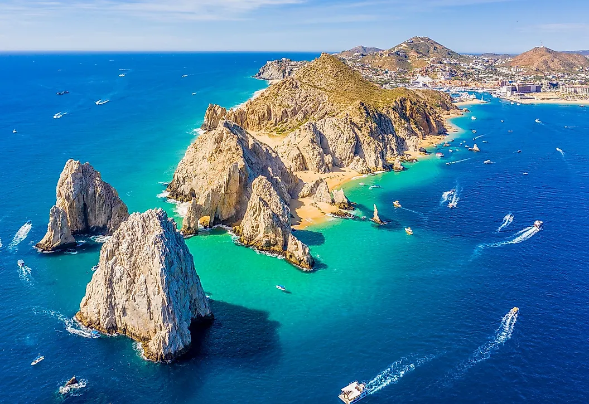
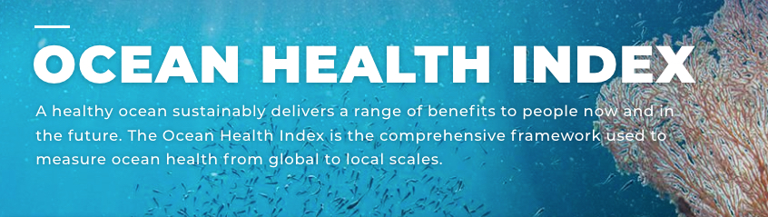

---


```{r}
#| echo: false
#| warning: false
#| message: false

invisible(NULL)

# source("_data/functions/start_script.R")

```


This website is the **Information Hub** for the [Ocean Health Index](https://oceanhealthindex.org/) (OHI) assessment tailored to the unique concerns and priorities of the Gulf of California, Mexico. Experts in the Goalkeeper Groups and Expert Working Group can use it to follow the OHI Gulf of California project as it develops.

A two-page summary of the project is available [here](https://drive.google.com/file/d/1Oyxpk6r32l_L48jniwDTfmvNVvbnZZUE/view?usp=sharing) y [en español](https://drive.google.com/file/d/1HayGmDUfaRnn1rY4QwEr_tml5QrLrFsU/view?usp=sharing).

Fall 2026 scores and next steps are on the [Project Update (Fall 2026)](chapters/project_update_fall_2026.qmd) page.

---

<br>

:::: {.columns}

::: {.column width="50%"}

The objectives of this Gulf of California OHI project are to:

- establish a baseline measure of current ocean health and provide a framework to monitor and communicate the region's condition over time.

- gather and nurture a community of engaged stakeholders from diverse backgrounds.

- create an accessible open-source inventory of marine resources for the Gulf of California that can be built upon over time.

:::

::: {.column width="50%"}


:::

::::


<br>
<br>


## History and philosophy of OHI

The Ocean Health Index (OHI) is a scientific method, tool, and community for channeling the best available scientific information into marine policy ([Halpern et al. 2012](https://doi.org/10.1038/nature11397)). It is designed to:

- measure how well the ocean is delivering benefits to humans without compromising its ability to deliver those benefits in the future
- boil complex information into easy-to-understand metrics
- remain flexible to different contexts
- stimulate actions to improve ocean health
- be repeatable, so progress can be tracked through time

A central philosophy of the OHI is that, while humans exist, they will always be an important part of marine systems. Rather than treating people as separate from ocean health, the Index incorporates human benefits such as employment, food provision, and sense of place alongside ecological measures.

The first global OHI assessment was conducted in 2012, calculating scores for all 220 coastal countries and territories. The assessment has been repeated every year since. Building on this global framework, OHI+ assessments apply the same methodology at smaller, regional scales. To date, 46 regional assessments have been conducted worldwide, spanning Asia (15), Oceania (7), Europe (6), North America (6), South America (6), Africa (4), Antarctica (1), and the Arctic (1).



<br>
<br>


## Overview of OHI for the Gulf of California

The Ocean Health Index Gulf of California (GoC) Project applies the global OHI framework to the Gulf of California, a critical and biologically rich marine region bordered by Baja California, Baja California Sur, Sonora, Sinaloa, Nayarit, and a small stretch of Jalisco coastline. The Gulf was divided into nine OHI regions based on the unique ecological and social attributes of the area, as well as management regions from the Programas de Ordenamiento Ecológico Marino (POEM). See the [OHI GOC Regions map](chapters/OHIregions.qmd).

### The Ocean Health Platform: a three-legged stool

The Gulf of California Ocean Health Index project uses a novel framework to improve long-term Gulf health by linking measurement, management, and investment:

- **Index.** The Ocean Health Index framework, built at NCEAS with support from GoC experts, tracks the health of the Gulf of California over time.
- **Action.** Direct management and programmatic changes are made by supporting agencies and organizations to increase GoC health based on areas of need identified by the Index.
- **Investment** (still in development). An investment fund supports companies improving Gulf health, using a dual-return model: 50% from company performance and 50% from Gulf health improvements as measured by the Ocean Health Index.

For the project to be successful, the Index leg of the stool needs to be the best it can be. Index development is carried out by three collaborating groups:

- the **Expert Working Group**, which adapts the high-level framework and reviews preliminary results
- the **OHI Core Team** at NCEAS, UC Santa Barbara, which implements goal models and calculates scores
- the **Goalkeeper Groups**, groups of subject matter experts for each goal who determine appropriate data sources and reference points

<br>
<br>


## OHI GoC goals

A healthy ocean, as defined by the OHI GoC framework, provides the following:

Goal | Definition
---------------- | ---------------------------------------
Biodiversity (BD) | A diversity of healthy marine species, habitats, and landscapes
Sense of Place (SP) | A deep sense of identity and belonging provided through connections with our marine communities
Livelihoods & Economies (LE) | High quantity and quality of ocean-dependent jobs and local revenue
Food Provision (FP) | Sustainably harvested seafood from wild-caught fisheries and mariculture
Tourism & Recreation (TR) | Opportunities for people to enjoy coastal areas through tourism and recreation
Natural Products (NP) | Sustainably harvested ocean-derived living resources for purposes other than consumption
Habitat Services (HS) | Carbon storage, protection from storm surge and erosion, and filtration services provided by living natural habitats, such as mangroves and sand dunes
Access Opportunities (AO) | Opportunities for local community members to access local natural resources, including small-scale fishery resources and the beach
Clean Waters (CW) | Coastal waters that are free of contaminants
Safety & Security (SS)* | Proposed as a unique pressure that influences the status of other goals (rather than as a standalone goal), with varying weight depending on the goal. Considers both safety (the objective condition of crime and incidence of threats) and security (the subjective perception of safety, and trust in law enforcement and institutions)

\* Introduced by the Expert Working Group in addition to the global OHI framework.

The menu at the left provides more information about each goal. Research and ocean literacy remains a Goalkeeper topic and may ultimately sit within Sense of Place or resilience.

<br>
<br>


## Anatomy of a score

Each of the nine OHI regions of the Gulf of California receives a current status score for each goal on a scale of 0 to 100.

Current status reflects how well a goal is doing relative to a reference point. It is calculated as the present value of an indicator divided by a defined reference point. For example, current status for Food Provision might be measured as the proportion of fisheries catch coming from sustainably managed stocks, while current status for a habitat-protection goal might be the proportion of marine area protected relative to a 30% protected target.

**Current Status = Present / Reference**

Additionally, each goal will be evaluated for pressures and resilience.

- **Pressures** are factors that negatively impact the goal, which could potentially reduce the current status scores in the future.
- **Resilience** measures are variables that mitigate those pressures, which can offset negative pressures and raise future current status scores.

**Trend**, the recent change in current status over time, will be displayed alongside the current status score as a separate representation of the score’s trajectory in recent years. For example, a region's Livelihoods & Economies (LE) goal may show a current status score of 88, with a (+) trend indicator shown next to it, signaling that the current status has been increasing over the last couple of years.

### From goals to the overall Index scores

This current status is calculated for each of the OHI goals. Several of these goals (for example Food Provision, Livelihoods & Economies, and Sense of Place) are composed of sub-goals, which are combined into one score for each goal. The resulting goal scores are then combined into the overall Ocean Health Index score for each region.

Expert Working Groups and Goalkeeper Groups focused on evaluating the current status scores: reviewing the associated model, verifying reference points, and suggesting small improvements. Pressure and resilience measures will be addressed in later stages of the process.


:::{.callout-tip}
## To learn more about the Ocean Health Index...


- The [oceanhealthindex.org](https://oceanhealthindex.org/) website is a good place to learn more about the OHI framework.

- This [resource](https://oceanhealthindex.org/ohi+/conduct/learn/) provides a nice readable summary of the OHI.

:::
